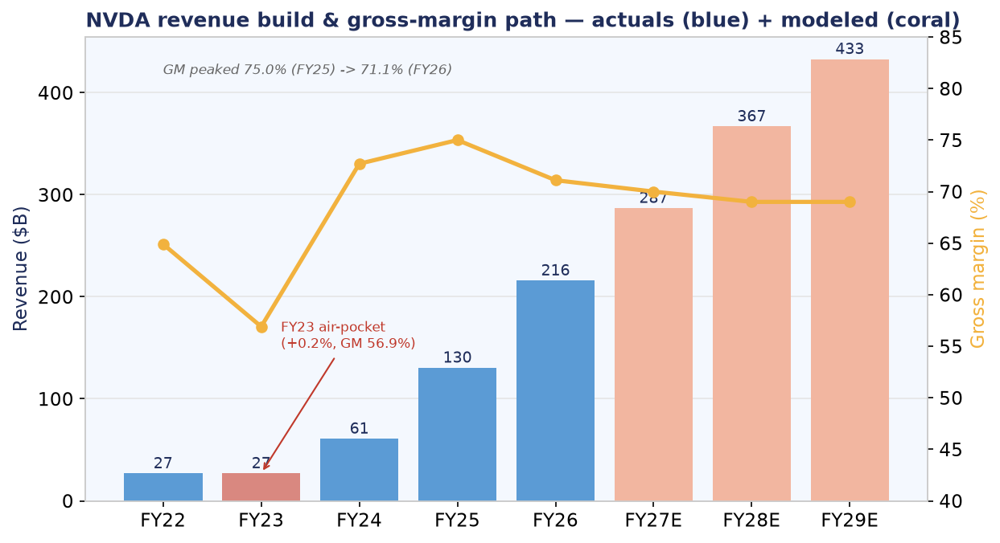
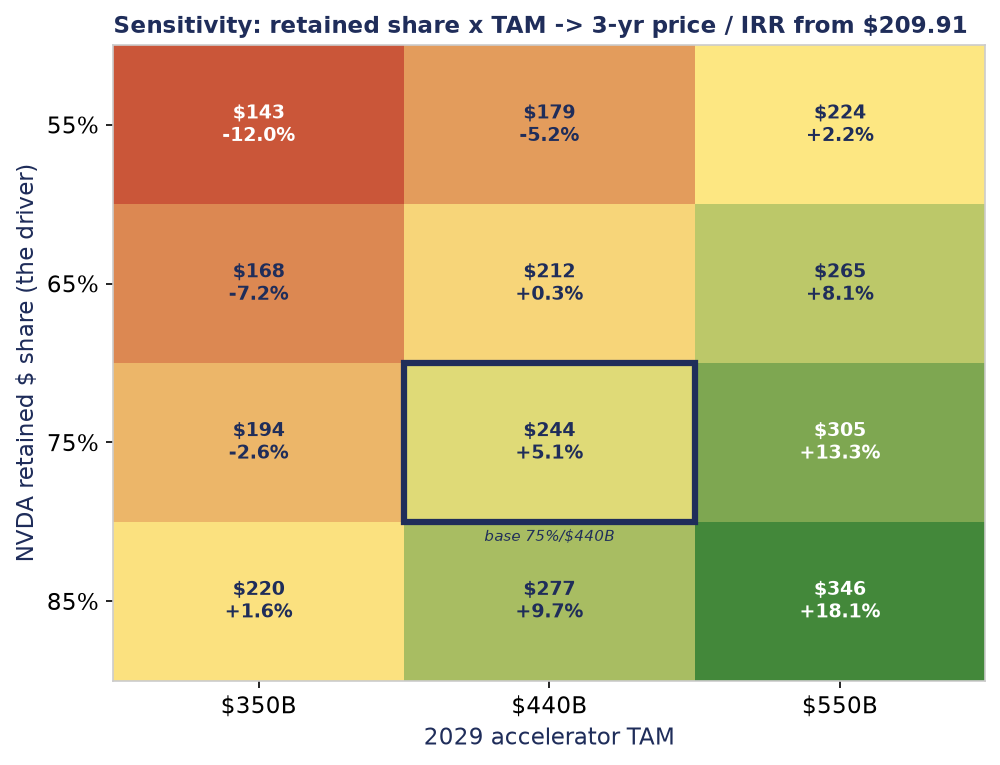
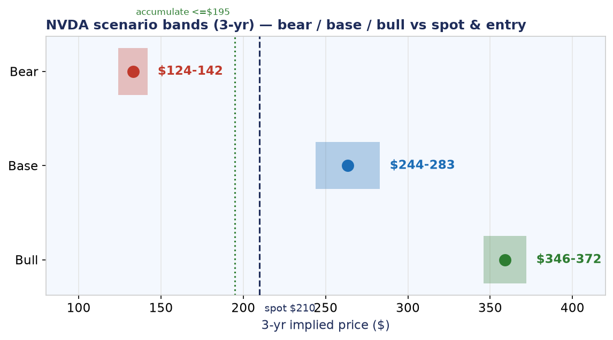
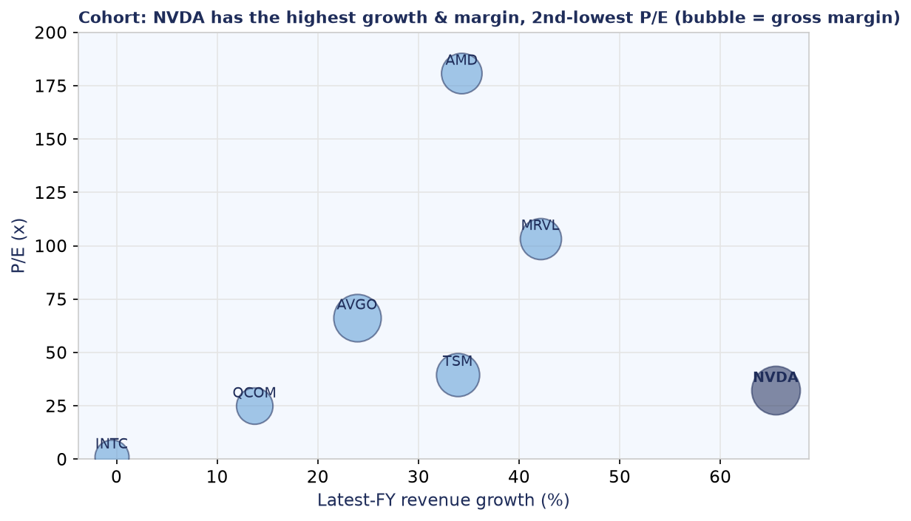

# NVIDIA (NVDA) — Complete Investment Analysis

### Long & Short · Deep-Tech Investment Desk · data as-of 2026-06-22 · spot $209.91

**Senior call: LONG-biased but two-sided, with entry discipline — accumulate ≤ $195, do not chase at $210.** The whole case collapses onto one technical number: NVDA's retained $ share of the AI-accelerator TAM (CUDA + NVLink rack-scale vs custom-ASIC inference encroachment, gated by CoWoS-L + HBM supply). At ~75% retained share and a $440B 2029 TAM the stock is roughly fairly valued (~+5% IRR at spot) — the edge is the *entry*, not the thesis.

**Contents:** 1) Visual summary · 2) Full write-up (the 6 assignment questions) · 3) The desk record (debate · synthesis · verdict) · 4) Long & Short theses in full · 5) Per-headline research appendix (10 deep dives).

*Tags: [FACT]=local SEC-XBRL/market brief · [EST]=modeled · [ASSUMPTION]=input · [ATTRIBUTED]=third-party. Data on this project's mid-2026 synthetic clock — re-pull prices before any live use. Not investment advice.*

<hr/>

## 1 · Visual summary

**Revenue build & gross-margin path** — actuals (blue) + modeled (coral); note the FY23 air-pocket.



**The AI-built sensitivity matrix** — retained share × 2029 TAM → 3-yr price / IRR. Red = the short's quadrant; green = the long.



**Scenario bands (3-yr)** — bear / base / bull vs spot and the accumulate line.



**Cohort** — NVDA has the highest growth & margin, 2nd-lowest P/E (bubble = gross margin).



<hr/>

## 2 · Full write-up — the six assignment questions

# NVIDIA (NVDA) — Deep-Tech Investment Analysis

**Technologist-first, dual-sided write-up. Maps 1:1 to `DECK_BLUEPRINT.md`.**

> **In-session analysis — no API key.** Produced by the Claude analyst desk reading
> `targets/NVDA/_brief.txt`. Data as-of **2026-06-22**; spot **$209.91** [FACT].
> Every load-bearing number is tagged **[FACT] / [ESTIMATE] / [ASSUMPTION] / [ATTRIBUTED]**.
> No figures are invented — canonical numbers only. Where the bull and bear disagree,
> both readings are shown and reconciled by the senior call.

**The one-line hook (Slide 1):** *NVDA moved the unit of sale from a chip to a coherent
rack — and the whole investment case now collapses onto a single technical number:
the accelerator dollar-share it retains as inference migrates to custom ASICs.*

**Senior call up front:** **LONG-BIASED but two-sided, with entry discipline —
accumulate below ~$195, do not chase at $210.** At ~75% retained share and a $440B
2029 TAM the stock is roughly fairly valued (~+5% IRR at spot); the edge is in the
*entry*, not the thesis. Flip to a paired underweight only on a confirmed share-loss
tell, never on a margin headline alone.

---

## Q1 — The Technical "Moat" (Blueprint slides 6–9, 24)

### ELI5 (slide 6): what NVDA actually sells now
Picture a giant AI model as a single huge brain. One chip can only hold a slice of it,
so the slices have to constantly talk to each other. **NVDA's trick is not making the
fastest single chip — it is wiring 72 chips together so tightly they behave like one
gigantic chip.** Imagine 72 office workers who, instead of emailing, share one desk and
one whiteboard at conversational speed. That shared whiteboard is the moat. A rival can
build a faster single worker (a custom ASIC), but it still can't replicate the
72-at-one-desk room — *and* it can't replace the 18 years of software everyone already
wrote for NVDA's room.

### The specific engineering choice that is the moat (slide 9)
The defensible advantage is **not any single die** — a hyperscaler ASIC can match TOPS/$
on one piece of silicon. It is the **scale-up coherence domain**:

- **Interconnect:** NVLink/NVSwitch fuse 72 GPUs into one **~130 TB/s, ~1.8 TB/s/GPU**
  non-blocking fabric (**>14x PCIe Gen5**), so a trillion-parameter Mixture-of-Experts
  model behaves as a single accelerator with most expert-hops staying in-rack
  [ATTRIBUTED]. SemiAnalysis measured GB200 NVL72 at **up to ~28x MI355X throughput on
  DeepSeek-R1 MoE** [ATTRIBUTED].
- **Software:** ~18 years of CUDA (cuDNN / TensorRT-LLM / NCCL / Triton) makes the
  switching cost *the entire ML software stack* [ATTRIBUTED].
- **Packaging allocation:** CoWoS-L 2.5D packaging (LSI bridges, ~5.5–6x reticle area)
  that NVDA **pre-books at TSMC** [ATTRIBUTED].
- **Cadence:** an annual co-design cycle (Hopper→Blackwell→Rubin→Feynman) re-touches the
  perf/watt frontier every ~12 months — faster than any challenger's design loop
  [ATTRIBUTED].

**Three independent moats — software, interconnect, packaging allocation — sit on top of
each other; a competitor must beat all three at once.**

### The honest counter (the technologist's caveat)
The moat's load-bearing claim — *"ASICs erode inference but NOT frontier-training /
large-MoE economics"* — is the one place the adversarial verification dented the bull
(LONG LB1: **weakened** on all three lenses). Real-world frontier behavior contradicts the
neat line: **Anthropic committed (Nov-2025) toward ~1M Google TPUs by 2027; Meta is
reportedly negotiating TPU leasing from 2026; Gemini trains frontier/MoE entirely on TPU**
[ATTRIBUTED]. So the moat is real at the *inference* margin and at the *frontier core* —
but the frontier is no longer 100% NVDA-only. That is exactly why the whole case reduces
to *retained share* rather than "the moat is binary."

---

## Q2 — Commercial Scaling: specs → profit / margin / share (Blueprint slides 27, 20–22)

**The proof chain — the engineering choice monetizes at a level nothing else in semis
approaches.** FY26 (anchor, all [FACT]):

| Metric | FY26 | Tag |
|---|---|---|
| Revenue | **215.94B (+65.5% YoY)** | [FACT] |
| Gross margin | **71.1%** (peaked 75.0% FY25) | [FACT] |
| Operating margin | **60.4%** | [FACT] |
| Net margin | **55.6%** | [FACT] |
| Net income | **120.07B** | [FACT] |
| Operating cash flow | **102.72B** | [FACT] |
| R&D | 18.50B (8.6% of sales) | [FACT] |
| Cash / LT debt / equity | 10.61B / 7.47B / 157.29B | [FACT] |

That is a **hardware bill-of-materials earning software economics.** The nearest
custom-silicon enabler **AVGO runs ~40% op margin; AMD ~11%** [FACT]. R&D at only 8.6%
of sales means the annual cadence **self-funds**, and a near-unlevered balance sheet means
the OpenAI/neocloud investments are paid from cash flow, not debt — categorically unlike
the Lucent/Nortel vendor-financing template the bears invoke.

**Share-economics caveat (slide 27, honest version):** the verification *weakened but did
not refute* the inference-leakage thesis (SHORT LB2: **weakened**, market lens **high**).
ASIC units grew **+44.6% vs merchant GPU +16.1% in 2026** [ATTRIBUTED]; bears model NVDA
inference share falling from ~90% toward **20–30% by 2028** [ATTRIBUTED]. The cap on the
threat: much of the ASIC "40–65% lower TCO" [ATTRIBUTED] is hyperscalers pricing captive
silicon at *cost* (no ~71% NVDA margin embedded), and only ~4–5 buyers can build captive
ASICs at all. **Blended ASP/GM dilutes if inference share leaks — even if unit count
holds.** That is the single lever this whole report turns on.

---

## Q3 — PxQ + how the end market grows (Blueprint slides 20–22, 10)

**PxQ redefined upward.** NVDA shifted the sellable SKU from a **~$30–35K discrete GPU**
to a **~$3M GB200 NVL72 rack**, with **Vera Rubin NVL72 reportedly up to ~$8.8M**
[ATTRIBUTED] — capturing the tray, NVLink switch, Grace CPU and networking margin a
chip-only vendor never sees.

**Q (volume) and the dollar pie:**
- Revenue compounded **26.97B → 60.92B → 130.50B → 215.94B** [FACT] — ~85B of
  *incremental* revenue in FY26 alone.
- Four hyperscalers guiding **~$725B 2026 capex, +~77% YoY** [ATTRIBUTED].
- Accelerator TAM **~$140B (2024) → >$440B (2030)** [ATTRIBUTED].

**The key PxQ insight:** *the dollar pie can expand faster than NVDA's share erodes.* In
the sensitivity model, holding share at 75% but moving TAM $350B→$550B swings FY29 price
**$194→$305** [ESTIMATE] — nearly as large as the share lever itself. **Even with share
erosion, NVDA's revenue can grow if the market inflects faster.**

---

## Q4 — Value chain: upstream → NVDA → downstream (Blueprint slides 13–14)

```
   UPSTREAM                         NVDA (the required step)                 DOWNSTREAM
 ┌──────────────┐              ┌──────────────────────────────┐         ┌──────────────────┐
 │ TSMC (wafers,│              │ Designs GPU + NVLink/NVSwitch │         │ Hyperscalers:    │
 │ CoWoS-L pkg) │  ───────►    │ fabric; writes CUDA stack;    │ ──────► │ MSFT/AMZN/GOOG/  │
 │ SK Hynix/    │              │ integrates GB200/Rubin RACK;  │         │ META (~$725B '26 │
 │ Micron (HBM) │              │ pre-books TSMC CoWoS-L        │         │ capex) [ATTRIB]  │
 │ ASML/AMAT    │              │ allocation (~60% of 2026)    │         │ + neoclouds      │
 └──────────────┘              └──────────────────────────────┘         │ (CoreWeave) +    │
   The supply CAP:                The value-ADD: turns commodity          │ OpenAI/Anthropic │
   HBM4 + CoWoS-L +               silicon into a coherent rack            └──────────────────┘
   Taiwan + POWER                 with software lock-in                     The CONCENTRATION
   are the bottlenecks                                                      + circularity risk
```

- **Upstream:** TSMC (CoWoS-L), SK Hynix/Micron/Samsung (HBM), ASML/Applied Materials.
  These — plus **power availability** (RAND: power, not chips, is the binding constraint
  [ATTRIBUTED]) — *cap deliverable units regardless of design wins.*
- **NVDA's required step:** integration of silicon + interconnect + CUDA + packaging
  allocation into a rack — the irreplaceable middle.
- **Downstream:** the ~5 hyperscalers, neoclouds, and AI labs. **This is also the risk:**
  the same ~5 customers that are NVDA's revenue concentration are *funding their own
  silicon* (TPU/Trainium/Maia/MTIA via AVGO/MRVL) — the customers are the competitors.

---

## Q5 — Financial model, sensitivity matrix, and the dual thesis (Blueprint slides 31–34)

### Valuation reconciliation — the 32x vs 43x denominator, honestly

| Item | Value | Tag |
|---|---|---|
| Spot price | $209.91 | [FACT] |
| Reported P/E | 32.15 | [FACT] |
| Trailing GAAP EPS (FY26) | $4.90 | [FACT] |
| FY26 net income | $120.07B | [FACT] |
| **Implied diluted shares** (NI ÷ EPS) | **~24.5B** | [ESTIMATE] |
| Market cap (spot × 24.5B) | **~$5.14T** | [ESTIMATE] |
| **Trailing P/E** (209.91 ÷ 4.90) | **42.8x** | [ESTIMATE] |
| **Implied forward EPS** (209.91 ÷ 32.15) | **~$6.53** | [ESTIMATE] |
| Forward/trailing EPS step required | **+33%** | [ESTIMATE] |

**Stated plainly:** the two numbers are not in conflict — they are the same valuation
viewed through two clocks. NVDA trades at **42.8x trailing GAAP** [ESTIMATE on FACT] and
**32.15x a forward number** [FACT] that bakes in ~+33% EPS growth to ~$6.53 [ESTIMATE].
The decisive fact the adversarial work surfaced: **reaching $6.53 forward EPS at the FY26
net margin of 55.6% [FACT] requires only ~$286B revenue, i.e. +33% YoY [ESTIMATE]** —
roughly *half* the +65.5% NVDA just printed and a fraction of FY25's +114% / FY24's +126%
[FACT]. **The forward multiple is built on a below-trend, already-decelerated bar, not a
heroic one.** PEG is **sub-1.0** [ESTIMATE] vs AMD 180.8x, MRVL 103.4x, AVGO 66.2x [FACT]
on slower growth and lower margins.

### 3-yr (FY2029) model assumptions — every input tagged

| Driver | FY2026 anchor | FY2029 base input | Tag |
|---|---|---|---|
| 2029 accelerator TAM | ~$140B (2024) | **$440B** (mid of ~$350–550B) | [ATTRIBUTED] |
| **NVDA retained $ share** (the single driver) | ~80–90% effective | **~75%** (ASIC inference leakage) | [ASSUMPTION] |
| Datacenter = % of revenue | — | **88%** | [ASSUMPTION] |
| Total revenue | $215.94B [FACT] | **~$457B** (+40/28/18% path) | [ESTIMATE] |
| Net margin | 55.6% [FACT] | **54%** | [ASSUMPTION] |
| Diluted shares | ~24.5B [EST] | **~24.4B** | [ASSUMPTION] |
| Net income | $120.07B [FACT] | ~$247B | [ESTIMATE] |
| EPS (FY29) | $4.90 [FACT] | **~$10.1** | [ESTIMATE] |
| Exit P/E | 32.15x [FACT] | **28x** (de-rate as growth normalizes) | [ASSUMPTION] |

> **Margin logic:** LONG LB2 verification *holds* — **Q4 FY26 GM exited at ~75.0% GAAP**
> [ATTRIBUTED, NVDA 8-K], so the 71.1% full-year figure is a **ramp-trough average, not a
> run-rate**. I still haircut to 54% net for prudence against recurring per-architecture
> (Rubin/Feynman) yield troughs and inference-mix dilution — I do **not** model a return
> to the 55.8% peak.

### The AI-built sensitivity matrix — single technical driver (retained accelerator share) × 2029 TAM

Each cell = **implied FY2029 price / 3-yr IRR from $209.91** [ESTIMATE]. Held constant:
net margin 54% [ASSUMPTION], 24.4B shares [ASSUMPTION], exit 28x [ASSUMPTION], datacenter
= 88% of revenue [ASSUMPTION].

| Retained accelerator share ↓ / 2029 TAM → | **$350B** | **$440B** (base) | **$550B** |
|---|---|---|---|
| **55%** (heavy ASIC encroachment) | $143 / **-12.1%** | $179 / **-5.1%** | $224 / **+2.2%** |
| **65%** (meaningful inference leakage) | $168 / **-7.1%** | $212 / **+0.3%** | $265 / **+8.0%** |
| **75%** (base — frontier held, inference shared) | $194 / **-2.5%** | **$244 / +5.2%** | $305 / **+13.3%** |
| **85%** (moat holds, ASICs stay niche) | $220 / **+1.6%** | $277 / **+9.7%** | $346 / **+18.1%** |

**Reading:** the entire **bottom-left quadrant** (share ≤65% AND TAM ≤$440B) prices NVDA
*below* today's $209.91 over three years — the short's home turf. The **top-right
quadrant** (share ≥75% AND TAM ≥$440B) delivers low-double-digit IRRs. The base cell
(75% / $440B) = **$244, +5.2% IRR** — positive but unspectacular: the stock is roughly
fairly valued at spot, with the asymmetry sitting in the tails.

### Tornado read — what actually moves the value (base cell ±)

1. **Retained share (55%→85%):** ~**$98 / 47%** — *the technical driver, dominates.*
2. **2029 TAM ($350B→$550B):** ~**$93** (at 75% row, $194→$305) — nearly co-equal; the
   dollar pie can expand faster than share erodes (the LONG's core point).
3. **Exit multiple (22x→34x):** ~**$121** spread — large but a *sentiment* lever, not a
   fundamental one; weighted least because a de-rate is the likeliest direction.
4. **Net margin (46%→57%):** ~**$58** spread — the **smallest fundamental swing.** The
   bear's whole case rests here, yet it moves value least.

**Punchline:** the bear is loudest on margin (#4, the *smallest* lever) and the short only
truly works if it is *right on share* (#1). Margin compression alone, even to 46% net,
still clears ~$241 at base TAM/multiple — **the margin short is not enough; you need the
share short.**

---

### The LONG thesis
**"The unit of sale moved from a chip to a coherent rack, and the moat moved with it."**

The moat is three stacked, independent layers (software + interconnect + packaging
allocation) a competitor must beat *simultaneously*. It monetizes at FY26 **71.1% GM /
60.4% op / 55.6% net** [FACT] — software economics on a hardware BoM, self-funding R&D,
near-unlevered. The "margin roll" is a Blackwell-ramp/CoWoS-L trough (Q4 FY26 GM exited
~75% GAAP [ATTRIBUTED]), not structural — and the tornado shows margin is the *smallest*
fundamental lever anyway. PxQ redefined upward ($30K GPU → $3M rack → ~$8.8M Rubin rack
[ATTRIBUTED]) into a TAM inflecting to >$440B [ATTRIBUTED]. At 32x forward (sub-1.0 PEG)
vs AMD 180.8x / MRVL 103.4x / AVGO 66.2x [FACT], it is the cheapest, highest-margin,
fastest-growing name in the group.

- **Valuation [ESTIMATE]:** Base **$244–283 / +5% to +10% IRR** (share 75%, TAM $440B,
  nm 54%, 28x). Bull **$346–372 / +18% to +21% IRR** (share 85%, TAM $550B, nm 55%, 30x).
- **Entry / trade [FACT inputs]:** **accumulate ≤$195, full size ≤$180; ~2:1
  reward/risk.** Median sell-side **~$300**, **8/8 Buy** [FACT].
- **Holding period:** ~3 years (to FY2029).
- **What breaks the long:** an FY23-style air-pocket off a $5.1T base; net margin
  sustained below ~50% as inference migrates to ASICs faster than TAM grows; or a
  CoWoS-L/HBM4/Taiwan supply shock. The asymmetry favors the bull only while GM holds the
  high-60s and growth stays >25%.

### The SHORT thesis
**"The rent is already compressing while the multiple still prices perfection."**

Not a fraud short — the moat (NVL72 measured up to 28x MI355X on DeepSeek MoE [ATTRIBUTED])
and CUDA are conceded. It is a **margin-and-multiple / share-leakage** short. GM **peaked
75.0% (FY25) and rolled to 71.1% (FY26) during +65.5% growth** [FACT] — margin fell at the
*top* of the cycle. Inference (~2/3 of compute [ATTRIBUTED]) migrates off merchant GPUs to
custom ASICs at 40–65% lower TCO [ATTRIBUTED]; bears model NVDA inference share falling
toward **20–30% by 2028** [ATTRIBUTED]. FY23 is the proven failure mode (rev +0.2%, GM
64.9%→56.9%, op 37.3%→15.7%, EPS $0.17 [FACT]). Circular financing (>$40B AI-equity
commitments vs $10.61B cash [FACT]; OpenAI ~$14B 2026 loss [ATTRIBUTED]) degrades the
demand signal. On a **42.8x trailing** name [ESTIMATE], a single soft quarter hits hard.

- **Valuation [ESTIMATE]:** Bear **$124–142 / -12% to -16% IRR** (share 55–60%, TAM
  ~$300–350B, nm 48–50%, 22–24x). Target on the thesis: **$140–160.**
- **Entry / trigger:** **tactical, defined-risk — put spread + AVGO/ASIC pair** on a
  share-loss tell: **GM <67% structural &/or DC rev <+25% &/or frontier-MoE moving
  off-NVDA.** Not an outright short (8/8 Buy, median ~$300, deep borrow → squeeze risk).
- **Holding period:** event-driven, ~6–18 months to a confirmed tell.
- **Why honest:** the adversarial work **refuted (high)** SHORT LB1 (margin "structurally
  peaked") on all three lenses — Q4 FY26 GM exited ~75% GAAP [ATTRIBUTED]; and the forward
  EPS bar is *below-trend*, not heroic. The short needs the *share* leg, which only
  *weakened* the bull — it did not break it.

### The senior call (the desk verdict)
**LONG-BIASED but two-sided, with entry discipline — accumulate below ~$195, do not chase
at $210.** What tips it long: the adversarial verification was decisive against the SHORT's
core claim — **SHORT LB1 (margin "structurally peaked") was refuted high on all three
lenses** because Q4 FY26 GM exited ~75% GAAP [ATTRIBUTED], so 71.1% is a ramp-trough
average, and the tornado shows margin is the *smallest* fundamental lever anyway. What
keeps it two-sided: **SHORT LB2 (inference share leakage) only weakened — it survived** —
and the verification surfaced real frontier encroachment (Anthropic→~1M TPUs, Meta
TPU-leasing) that dents the LONG's "ASICs can't touch frontier/MoE" claim. The whole call
therefore collapses onto one technical number: **NVDA's retained accelerator share.** At
~75% retained and a $440B 2029 TAM the stock is roughly fairly valued (~+5% IRR at spot),
so **the edge is in the entry, not the thesis** — buy the share-holds optionality cheaply
below $195, and flip to a paired underweight only on a confirmed share-loss tell, never on
a margin headline alone.

**Peer context [FACT]:** AMD 542.50 / 180.8x / GM 49.5%; AVGO 397.32 / 66.2x / GM 67.8%;
MRVL 301.79 / 103.4x; TSM 469.46 / 39.7x / GM 56.1%; QCOM 228.73 / 24.9x; INTC 139.12 / neg.

---

## Q6 — Investment philosophy (Blueprint slide 35)

**Find the one technical variable the whole valuation hangs on, price the tails, and let
the entry — not the narrative — carry the edge.** Great deep-tech businesses are not won
or lost on the loudest debate (here, margins) but on the quietest structural one (here,
retained dollar-share as workloads migrate). I underwrite long *and* short on the same
fact set, stress the load-bearing claims adversarially until one side *refutes* rather than
merely rebuts, and then size to the asymmetry: when a fairly-valued compounder offers free
optionality below a disciplined entry, you buy the optionality cheaply rather than chasing
the story at spot — and you express the bear case as defined-risk relative value, not a
conviction zero, because being *right on the fundamental and wrong on the price for a year*
is the most expensive mistake in this sector.

---

## Open questions / what would change the thesis (Blueprint slide 36)

- **Does the frontier stay NVDA-anchored?** Anthropic→~1M TPUs and Meta TPU-leasing
  [ATTRIBUTED] are the early tell that large-MoE training is *not* CUDA-locked. A second
  frontier lab going off-NVDA would push the model toward the 65% row.
- **Where does GM settle post-Rubin ramp?** A sustained run-rate below ~67% structural
  (not a single ramp quarter) would validate the bear's structural read.
- **Does hyperscaler capex ROI prove out?** ~$725B 2026 capex [ATTRIBUTED] depends on
  AI-application returns still unproven at that spend; a single capex pause hits a 42.8x
  name violently.
- **Power, not chips.** If power (RAND: the binding constraint [ATTRIBUTED]) caps
  deliverable units, share matters less than the TAM ceiling.

---

## Data-quality & source caveats (honest)

- **In-session, no API key.** Reasoning performed by the Claude desk on the deterministic
  data brief; the LLM agents 04–08 were not run.
- **Spot $209.91, reported P/E 32.15, the FY26 anchor are [FACT].** The valuation bridge
  (**42.8x trailing, ~$6.53 forward EPS, ~24.5B shares, ~$5.14T mcap**) is **[ESTIMATE]**
  derived arithmetically from those facts — not separately reported.
- **The FY2029 model is [ESTIMATE/ASSUMPTION].** TAM ($350–550B), retained share (the
  single driver), net margin (54%), share count and exit multiple (28x) are assumptions;
  the matrix prices/IRRs follow mechanically and are only as good as those inputs.
- **[ATTRIBUTED] items** (Q4 FY26 GM ~75% exit, NVL72 vs MI355X benchmark, ~$725B capex,
  Anthropic/Meta TPU moves, Rubin rack ASP ~$8.8M, ASIC TCO and unit-growth figures,
  circular-financing details) come from third-party sources cross-referenced in the brief,
  not audited financials — treat as directional, not precise.
- **Forward EPS is a market-implied figure**, not guidance: ~$6.53 is simply
  209.91 ÷ 32.15 [ESTIMATE]. The bull's 32x and the bear's 43x are the *same* valuation on
  two clocks; do not double-count.
- **Two-sided by design.** A "long" mandate still flags the short, and vice versa — the
  matrix tails, not a single point estimate, are the decision object.

<hr/>

## 3 · The desk record

### 3a · Debate (Financial 04 vs Tech 05)

# Debate — NVIDIA (NVDA)  ·  Financial Analyst (04) vs Tech Analyst (05)

*Produced in-session by Claude (no Anthropic API key used). Grounded in the data
brief collected locally on 2026-06-22: SEC XBRL fundamentals, Yahoo/CNBC prices,
finviz sell-side ratings, Google-News headlines. Numbers tagged
[FACT]=in the brief, [ESTIMATE]=my modeled assumption, [ASSUMPTION]=scenario input,
[ATTRIBUTED]=third-party source.*

**Question:** Is NVDA a long at today's price ($209.91 [FACT]), and what single
technical driver most moves the valuation? This is a real bull-vs-bear desk: each
analyst argues *both* sides of their own book before we hand the crux upstairs.

---

## Financial Analyst (04) — opening (LONG-leaning, but two-sided)

**Position: LONG the quality, on weakness — but I will make the bear's numerate case myself so the desk hears it.**

**The bull read.** The financials are the best in large-cap tech. FY26 [FACT]: revenue **$215.94B (+65.5% YoY)**, gross margin **71.1%**, operating margin **60.4%**, net margin **55.6%**, net income **$120.07B**, EPS **$4.90**, R&D **$18.50B** (8.6% of sales), operating cash flow **$102.72B**, and an effectively unlevered balance sheet (cash **$10.61B**, LT debt **$7.47B**, equity **$157.29B**) [FACT]. The three-year revenue path is **$26.97B → $60.92B → $130.50B → $215.94B** [FACT] — ~$85B of *incremental* revenue in FY26 alone. On valuation: reported P/E **32.15** [FACT] implies ~**$6.53 forward EPS** [EST]; trailing on $4.90 GAAP EPS is **~42.8x** [EST]. Either denominator is a sub-1.0 PEG against this growth. Versus the cohort NVDA is cheap-for-quality — AMD **180.8x**, MRVL **103.4x**, AVGO **66.2x**, TSM **39.7x**, only QCOM lower at **24.9x** [FACT]. Sell-side is **8/8 Buy, median ~$300** [FACT].

**Now the bear read I owe the desk.** The forward multiple is only "cheap" if you accept the *forward* denominator — and the same fact set reads as a **~43x trailing, falling-margin** name on a **~$5.14T** market cap (~24.5B implied diluted shares) [EST]. Gross margin **peaked at 75.0% (FY25)** and rolled to **71.1% (FY26)** — a ~390bp give-back *while* revenue grew +65.5% [FACT]. At FY26 scale each 100bp of GM is ~$2.16B of gross profit [EST]. Law of large numbers bites: to hold even ~30% growth NVDA must add **~$65B of net new revenue a year — roughly an entire AVGO FY25 ($63.89B)** [FACT/EST] — every year. And FY23 is the *proven* failure mode, not a hypothetical: in one digestion year revenue went flat (**+0.2%, $26.97B**), GM collapsed **64.9% → 56.9%**, operating margin **37.3% → 15.7%** [FACT]. Off a ~$5.1T base, a 32–43x multiple would not survive a repeat. **My honest weighting:** the multiple already embeds near-perfection, so the entry price *is* the trade. I do not chase $210; I accumulate below ~$195.

## Tech Analyst (05) — opening (SHORT-leaning, given a fair and strong voice)

**Position: the moat is real, but the value is migrating — this is a margin-and-multiple SHORT, expressed as an underweight/hedge, not a conviction zero.**

**[TECHNOLOGIST FIRST] What I concede up front.** The bull moat is physical and I do not dispute it. NVLink/NVSwitch fuses 72 GPUs into one **~130 TB/s, ~1.8 TB/s/GPU** non-blocking domain (>14x PCIe Gen5) so a trillion-parameter MoE behaves as a *single* accelerator; SemiAnalysis measured **GB200 NVL72 at up to ~28x MI355X** on DeepSeek-R1 MoE [ATTRIBUTED]. Wrap ~18 years of CUDA and pre-booked CoWoS-L allocation (~60% of 2026 [ATTRIBUTED]) around it and you have three stacked moats. You can love all of that and still short the *stock*.

**The bear thesis, stated numerately.**
1. **The company's own margin tell.** GM peaked at 75.0% and has *already* rolled to 71.1% [FACT] — compression arrived at the **top** of the cycle, before any volume slowdown, which argues structural (CoWoS-L/HBM4 cost-add, GB200-rack mix carrying more bought-in HBM/networking, hyperscaler price negotiation), not cyclical.
2. **The technical driver that decides it: inference-share leakage.** CUDA protects general-purpose, multi-model *training*. It does **not** protect single-model, high-volume *inference* (~two-thirds of compute [ATTRIBUTED]) where the hyperscaler owns the kernel stack and a fixed-function ASIC runs **40–65% lower TCO** [ATTRIBUTED]. TrendForce: ASIC units **+44.6% vs merchant GPU +16.1% in 2026**; bears model NVDA inference share falling **~90% → 20–30% by 2028** [ATTRIBUTED]. The customers — the same ~5 hyperscalers that are NVDA's revenue concentration — are funding TPU/Trainium/Maia/MTIA, enabled by AVGO/MRVL.
3. **Demand-quality drag.** NVDA committed **>$40B** to AI equity in early 2026 (OpenAI stake, CoreWeave/neocloud), an estimated **15–20% of FY26 datacenter revenue tied to OpenAI/Anthropic** [ATTRIBUTED/EST], OpenAI projected to lose ~$14B in 2026 [ATTRIBUTED]. Cash is only $10.61B [FACT] against those commitments — a reflexive, late-cycle slice of "demand" that drew explicit Nortel/Lucent comparisons [ATTRIBUTED].

**The long read I owe the desk — why this short is dangerous.** [INTELLECTUALLY HONEST] Shorting a **60.4% operating-margin, $102.72B-OCF, near-unlevered** compounder [FACT] is treacherous: the moat is real, sell-side is 8/8 Buy with a Baird $500 [FACT], a single beat-and-raise can squeeze 15–20% in a day, and the dollar pie is still growing double-digits — so I can be **right on margin/share and wrong on price** for a year. Therefore I do **not** short outright. I express it defined-risk (put spread) plus a relative-value pair (**long AVGO / ASIC basket vs short NVDA**) that monetizes the exact thesis — value moving from merchant GPU to custom-silicon enablers — while capping squeeze risk.

## Financial (04) — rebuttal to the Tech short

I tested the bear's lead claim adversarially and it **does not survive on the anchor data.** The "75.0% → 71.1% roll" compares a prior-year *peak* against a full-year *average* — an averaging artifact. The FY26 average was dragged by an early-Blackwell trough: Q1 FY26 carried a ~$4.5B charge taking GAAP GM to ~60.5% (~71.3% ex-charge), and critically **Q4 FY26 *exited* at ~75.0% GAAP** [ATTRIBUTED]. So 71.1% is a ramp-trough blend, not a run-rate; the run-rate already recovered to the prior peak. That refutes "structural, at the top of the cycle." And on valuation: to reach the ~$6.53 forward EPS at the FY26 net margin of 55.6% needs only **~$286B revenue, +33% YoY** [EST] — roughly *half* the +65.5% just delivered. The forward bar embeds a sharp deceleration; it is a **below-trend number, not a heroic one.** The cushion is ample.

## Tech (05) — rebuttal to the Financial long

Fair on the Q4 exit — I downgrade the margin leg accordingly; margin alone is **not** my short. But the *share* leg got stronger, not weaker, when I checked it. My one concession-killer for the bulls: the load-bearing bull claim is "ASICs erode inference but **not** frontier-training/large-MoE economics." The market is now contradicting that. **Anthropic committed (Nov-2025) to hundreds of thousands of Google TPUs, scaling toward ~1M by 2027; Meta is reportedly negotiating TPU leasing from 2026; Google trains Gemini frontier/MoE entirely on TPU** [ATTRIBUTED]. Those are exactly the frontier, large-MoE workloads the bull says the rack-coherence moat fences off. So the moat holds at the *core* but is being probed at the edge the bull called untouchable. Hold accelerator share at ~75% and I lose; let it drift to 55–65% and the stock is dead money to down over three years.

## Where they converge

- **The margin short is dead; the share short is alive.** Both desks agree the 71.1% figure is a ramp-trough average (Q4 exited ~75% [ATTRIBUTED]) and that **margin is the *smallest* fundamental lever** — even cutting net margin to ~46% still clears ~$241 at base TAM/multiple [EST]. The bear only truly works if it is **right on retained share.**
- **Entry discipline, both sides.** On a ~$5.14T base the multiple embeds a lot; neither analyst chases $210. Accumulate below ~$195, full size ≤$180 (~2:1 reward/risk); flip to a paired underweight (put spread + AVGO/ASIC pair, target $140–160) only on a confirmed **share-loss tell** — GM <67% structural, and/or DC rev <+25%, and/or frontier-MoE moving off-NVDA — never on a margin headline alone.
- **The dollar pie can outrun share erosion.** Four hyperscalers guiding ~$725B 2026 capex (+~77% YoY) and accelerator TAM ~$140B (2024) → >$440B (2030) [ATTRIBUTED] — so NVDA can lose share *and* grow dollars, which is precisely why the two variables must be modeled together.

## The crux handed to the senior desk — the single technical driver

**Retained accelerator share.** It is technical (does CUDA + NVLink rack-coherence + pre-booked CoWoS-L hold NVDA's *dollar* share against TPU/Trainium/Maia/MTIA inference — and now frontier-MoE — encroachment?), and the sensitivity matrix shows it dominates: holding the $440B base TAM, moving share **55% → 85% swings the FY29 price ~$179 → $277 (~$98 / ~47%)** — the widest single-driver move in the model, larger than the TAM swing (~$93) and far larger than the net-margin swing (~$58, the smallest fundamental lever) [EST]. The base cell (**75% share / $440B TAM = $244, +5.2% IRR** [EST]) says the stock is roughly *fairly valued* at spot, with the asymmetry in the tails: the bottom-left quadrant (share ≤65% AND TAM ≤$440B) prices NVDA *below* $209.91 over three years — the short's home turf — while the top-right delivers low-double-digit IRRs.

**Desk recommendation passed up:** LONG-biased but two-sided, with entry discipline. The edge is in the **entry, not the thesis** — buy the share-holds optionality cheaply below ~$195, and convert to a paired underweight only on a confirmed share-loss tell.

<hr/>

### 3b · Synthesis (neutral editor 06)

# Synthesis — NVIDIA (NVDA)  ·  Neutral Editor (06)

*In-session synthesis (no Anthropic API key used). Reconciles the 04 long vs 05 short
cases against the brief and the adversarial verification. Data collected locally
2026-06-22. Spot **$209.91** [FACT], reported P/E 32.15 [FACT] / ~42.8x trailing [EST].*
*Tags: [FACT] data brief · [EST] modeled estimate · [ATTRIBUTED] cited third party.*

## 1. Points of agreement
Both desks — long and short — converge on more than they dispute:
- **The moat is real, not a fraud short.** Both concede the rack-scale coherence domain (NVLink/NVSwitch fusing 72 GPUs into one ~130 TB/s fabric, measured up to ~28x MI355X on DeepSeek-R1 MoE [ATTRIBUTED]) plus ~18 years of CUDA. The short explicitly states "you can love the technology and still short the stock."
- **The financials are best-in-cohort.** FY26 revenue **215.94B (+65.5%)**, GM **71.1%**, operating margin **60.4%**, net income **120.07B**, OCF **102.72B**, near-unlevered (cash 10.61B, LT debt 7.47B, equity 157.29B) [FACT]. Nothing in semis monetizes at this level.
- **Entry discipline over a chase.** Neither side wants to buy at the 52-wk high. The base cell (75% share / $440B TAM) models **$244 / +5.2% IRR** [EST] from spot — positive but unspectacular, i.e. the stock is roughly fairly valued at $209.91 with the asymmetry in the tails.
- **The valuation denominator is internally inconsistent** and worth owning: 32.15x reported implies ~$6.53 forward EPS, but trailing GAAP EPS 4.90 is ~42.8x [FACT/EST]. Both sides agree the "cheap on P/E" framing leans on the forward number.

## 2. The key disagreement (the crux)
Strip away the agreement and the entire debate collapses onto **one technical number: NVDA's retained share of the accelerator TAM.**
- **Long (04):** the three stacked moats — CUDA software, NVLink interconnect, pre-booked CoWoS-L packaging — defend not just frontier *training* but **large-MoE / frontier economics broadly**, so ASICs erode commodity inference but cannot touch the high-value core; the dollar pie expands faster than share erodes.
- **Short (05):** this is a **margin-and-multiple short**, not a moat short. The battlefield is shifting from frontier training (NVDA unassailable) to **inference (~2/3 of compute)**, where the hyperscaler owns the kernel stack and a fixed-function ASIC at 40-65% lower TCO wins; blended ASP/GM dilutes even if unit count holds, and the multiple still prices perfection.

The tornado confirms this is the right crux: holding TAM at $440B base, moving retained share 55%→85% swings FY29 price **$179→$277 (~$98 / 47%)** — the single widest lever in the model, and it is technical, not financial.

## 3. Who had the stronger evidence after adversarial verification
The verification was **decisive in the long's favor on the loudest short claim, and a draw on the one that actually matters.**

- **SHORT LB1 (margin "structurally peaked at 75.0%, rolled to 71.1%") — REFUTED high on all three lenses.** The 75.0%→71.1% comparison pits a prior full-year *peak* (FY25) against a full-year *average* (FY26) — an averaging artifact. FY26's average was dragged down by a Q1 ~$4.5B Blackwell-ramp/China charge (GAAP GM ~60.5%, ~71.3% ex-charge), and **Q4 FY26 GM EXITED at ~75.0% GAAP** [ATTRIBUTED]. The margin already recovered to the peak; 71.1% is a ramp-trough blend, not a structural run-rate. The short's "single most important number" does not survive contact with the quarterly path.
- **SHORT LB2 (inference-share leakage to custom ASICs) — WEAKENED, but SURVIVED.** Direction holds: customer-controlled single-model inference is CUDA's weakest point, and captive ASICs carry a real 40-65% TCO edge [ATTRIBUTED]. But magnitude/timing are overstated — much of that edge is hyperscalers pricing captive silicon at *cost* (no ~71% margin embedded), and only ~4-5 players can build it. This is the short's real, undefeated ground.
- **LONG LB1 (ASICs erode inference but NOT frontier/large-MoE) — WEAKENED on all three lenses.** The verification surfaced genuine *frontier* encroachment that dents the long's load-bearing distinction: Anthropic committed (Nov-2025) to hundreds of thousands of Google TPUs scaling toward ~1M by 2027; Meta reportedly negotiating TPU leasing from 2026; Google trains Gemini frontier/MoE entirely on TPU [ATTRIBUTED]. ASICs are reaching exactly the frontier-MoE workloads the long said they couldn't.
- **SHORT LB3 ("zero cushion / forward EPS bakes in flawless execution") — WEAKENED high.** Quantitatively false: ~$6.53 EPS at FY26's 55.6% net margin needs only ~$286B revenue = **+33% YoY** [EST] — roughly half the +65.5% just delivered. The forward bar already embeds sharp deceleration; it is below-trend, not heroic.

**Net:** the short's *headline* (margin) is its weakest evidence and was refuted; the short's *quiet* claim (share leakage at the frontier) is its strongest and the long failed to fully rebut it. The long wins the verification on points, but not cleanly.

## 4. Bottom-line dual-sided call
**LONG-BIASED but two-sided, with entry discipline — accumulate below ~$195, full size ≤ ~$180; do not chase at $210.** The tornado settles the desk's posture: the bear is loudest on margin (the **smallest** fundamental lever — net margin 46%→57% moves value only ~$58), and the short *only truly works if it is right on share* (the dominant ~$98/47% lever). Margin compression alone, even to 46% net, still clears ~$241 at base TAM/multiple — **the margin short is not enough; you need the share short**, and the share short is real at the inference margin but unproven at the frontier/large-MoE core that anchors the 75-85% rows.

So the edge is in the **entry, not the thesis.** At ~75% retained share and a $440B 2029 TAM the stock is roughly fairly valued (~+5% IRR at spot). The trade is to buy the share-holds optionality cheaply below $195 (~2:1 reward/risk; median sell-side ~$300, 8/8 Buy [FACT]) — and flip to a **paired underweight** (defined-risk put spread + long AVGO/ASIC basket vs short NVDA, target $140-160) only on a confirmed share-loss tell, **never on a margin headline alone.**

## 5. What would change the conclusion — in BOTH directions

**What makes it a clear LONG (lean in, full size, raise the target):**
- **Share holds ≥75% with a fattening pie:** retained accelerator share ≥75% AND 2029 TAM ≥$440B → the top-right matrix quadrant, **$244-$346 / +5% to +18% IRR**. Best evidence: GM stabilizes high-60s/low-70s (Q4-exit ~75% sustained), DC revenue keeps growing >25%, frontier/large-MoE training stays predominantly on NVLink racks, and the four-hyperscaler ~$725B 2026 capex (+~77% [ATTRIBUTED]) converts the pre-booked CoWoS-L (~60% of 2026) into revenue.
- The bull tail (85% share / $550B TAM) prints **$346-$372, +18-21% IRR** — the moat-holds, ASICs-stay-niche world.

**What makes it a clear SHORT (flip to the paired underweight, target $140-160):**
- **Confirmed share-loss tell — any of three technical triggers:** (1) **GM falling below ~67% structurally** (not a one-quarter ramp dip) toward merchant-peer levels; (2) **DC revenue growth decelerating below +25%** off the $5.1T base — the FY23 air-pocket template (rev +0.2%, GM 56.9% in a single year [FACT]) at 8x the scale; or (3) **frontier/large-MoE training visibly migrating off NVDA** (Anthropic/Meta TPU adoption broadening from inference into core frontier training).
- The bear quadrant (share ≤65% AND TAM ≤$440B) prices NVDA **below today's $209.91** over three years — bear case **$124-142, -12% to -16% IRR** (share 55-60%, TAM ~300-350B, net margin 48-50%, 22-24x). A circular-financing/funding-squeeze unwind (>$40B AI-equity commitments vs $10.61B cash, OpenAI ~-$14B 2026 [ATTRIBUTED]) or a hyperscaler capex pause would be the accelerant that gets there fast against a 32-43x multiple.

**The asymmetry, stated once:** the long works while GM holds the high-60s and growth stays >25%; the short works only on a confirmed *share* break, not a margin headline. Until one of those tells fires, the disciplined posture is patient accumulation below $195 — long the optionality, not the price.

<hr/>

### 3c · Senior verdict (07)

# NVDA — Senior PM Verdict (as-of 2026-06-22 clock; spot $209.91)

## VERDICT: LONG-BIASED, TWO-SIDED — accumulate ≤ $195, do not chase at $210
The debate reduces to a single technical question and the adversarial audit answered it asymmetrically. The SHORT's flagship claim — gross margin "structurally peaked at 75.0%→71.1% at the top of the cycle" [SHORT LB1] — was **refuted (high)** on all three lenses: Q4 FY26 GM **exited at ~75.0% GAAP** [ATTRIBUTED, NVDA 8-K], so 71.1% is a Blackwell-ramp-trough *average* (Q1 carried a ~$4.5B one-time charge [ATTRIBUTED]), not a run-rate. The SHORT's *surviving* claim is inference-share leakage to custom ASICs [SHORT LB2, weakened] — and that is the only thing that genuinely threatens the valuation. So the call is long, but disciplined, because at spot the base case only returns ~+5% IRR.

## VALUATION — reconcile the denominator honestly
- **Trailing:** $209.91 / $4.90 EPS [FACT] = **42.8x** [ESTIMATE]
- **Forward:** reported **32.15x** [FACT] implies **~$6.53 EPS** [ESTIMATE], a +33% step
- **The tell:** $6.53 at 55.6% FY26 net margin [FACT] needs only ~$286B revenue (**+33% YoY**) [ESTIMATE] — *half* the +65.5% just delivered [FACT]. The forward multiple sits on an already-decelerated bar, not a heroic one.
- **Mcap** ~$5.14T on ~24.5B implied diluted shares (NI/EPS) [ESTIMATE]. **Sub-1.0 PEG** vs AMD 180.8x, MRVL 103.4x, AVGO 66.2x [FACT].

## KPI SCORECARD
| KPI | NVDA | Read | Tag |
|---|---|---|---|
| Rev growth FY26 | +65.5% | Elite, but decelerating from +114%/+126% | [FACT] |
| Gross margin | 71.1% FY (Q4 exit ~75%) | Above all merchant peers; ramp-trough average | [FACT]/[ATTRIBUTED] |
| Operating margin | 60.4% | Best-in-semis | [FACT] |
| Net margin | 55.6% | Software economics on hardware BOM | [FACT] |
| R&D % sales | 8.6% | Cadence self-funds | [FACT] |
| Balance sheet | cash 10.61B / LT debt 7.47B / eq 157.29B | Unlevered; not Lucent/Nortel | [FACT] |
| Concentration risk | ~15–20% DC rev OpenAI/Anthropic-tied | Circular-financing watch (>$40B commits vs $10.6B cash) | [ATTRIBUTED/ESTIMATE] |
| Sell-side | 8/8 Buy, median ~$300 | Crowded long | [FACT] |

## THE SINGLE TECHNICAL DRIVER: retained accelerator $ share
CUDA + NVLink/NVSwitch rack-scale coherence + pre-booked CoWoS-L allocation defend frontier-training/large-MoE; custom ASICs (TPU/Trainium/Maia/MTIA) erode price-elastic single-model **inference** [verified: LB1 weakened, LB2 weakened/survived]. The caveat the audit forced: Anthropic→~1M TPUs by 2027 and Meta TPU-leasing show ASICs reaching *some* frontier/MoE work — so this is a *dollar-share* erosion story, not a fortress.

## MATRIX HEADLINE (retained share × 2029 TAM → 3-yr price/IRR from $209.91)
- **Base (75% share, $440B TAM): $244, +5.2% IRR** — roughly fairly valued at spot.
- Bottom-left (≤65% share, ≤$440B TAM) prices **below today** — the short's quadrant.
- Top-right (≥75% share, ≥$440B TAM) delivers **+13–18% IRR**.
- Share is the dominant lever (~$98 / 47% swing at base TAM); margin is the *smallest* fundamental lever (~$58).

## THE TWO TRADES
- **LONG:** accumulate ≤ $195, full size ≤ $180. At $180, base PT $244–283 → ~+11–16% IRR vs bear floor ~$124–142 (≈2:1). Catalyst: clean Rubin GM print confirming high-60s/low-70s.
- **SHORT (tactical, put spread + AVGO/ASIC pair):** only on a confirmed **share-loss tell** — GM <67% (structural, not one-time) AND/OR DC rev <+25% YoY AND/OR disclosed frontier-MoE share loss. Target $140–160.

## WHAT FLIPS THE CALL
- **To outright short:** a frontier/large-MoE flagship trained off-NVDA at scale + a structural sub-67% GM quarter → share lever breaks, bear quadrant activates.
- **To high-conviction long/chase:** Rubin ramp prints high-60s/low-70s GM AND DC rev re-accelerates >+40%, validating ≥85% retained share → top-right $346–372.
- **Net:** decisive but humble — the edge is the *entry*, because the thesis itself is balanced on one number neither side has yet proven.

<hr/>

## 4 · The theses in full

### 4a · LONG thesis

# NVDA — LONG Thesis  ·  (Bull PM (04/05))

*In-session (no Anthropic API key). Data 2026-06-22, spot $209.91 [FACT]. Tags: [FACT] data brief · [ESTIMATE] modeled · [ASSUMPTION] input · [ATTRIBUTED] third-party.*

**Single technical driver:** Terminal blended net margin, which is set by NVDA's ability to defend high-ASP rack-scale share (NVLink coherence domain) against ASIC inference encroachment. At base-case FY29 revenue (~$457B), net margin of 45% vs 58% swings FY29 EPS from ~$8.4 to ~$10.9 and the 28x PT from ~$236 to ~$304. Everything else (TAM size, unit volume, cadence) routes through whether the rack moat keeps blended margin in the mid-50s as inference mix grows.

**Entry / expression:** Accumulate $185-210 (spot $209.91, near the lower half of the 52wk [142.03, 236.54] range). Scale in: half here, half on any retest toward $170-185 (a pullback to ~26x the ~$6.5 forward EPS). Add aggressively below $160 absent a thesis-breaking GM print.

**3-yr price targets:** bear $93 (FY23-style digestion: rev ~$236B, net margin ~48% toward peers, multiple compresses to ~20x; EPS ~$4.6) · base $288 (rev ~$457B FY29 at +40/28/18%, net margin ~55%, exit 28x; EPS ~$10.3 — coincides with sell-side median) · bull $448 (rev ~$600B consistent with NVDA's own ~$500B Blackwell+Rubin projection, net margin ~57%, multiple holds 32x; EPS ~$14.0)

**Return:** Base ~+11% IRR/yr (~37% cumulative to $288); Bull ~+29% IRR/yr (~113% cumulative to $448); Bear ~-24% IRR/yr (~-56% to $93). Probability-weighted (Base 50% / Bull 30% / Bear 20%) ~ +9-11% IRR with strongly positive convexity — the bull tail ($448) is larger than the bear tail given the unlevered balance sheet floors the downside.

**Load-bearing claims (the thesis depends on these):**
- **[LB1]** The defensible moat is the rack-scale coherence domain (NVLink/NVSwitch fusing 72 GPUs into one ~130 TB/s fabric) plus CUDA plus pre-booked CoWoS-L allocation — three stacked moats a competitor must beat simultaneously, which is why custom ASICs erode inference but not frontier-training/large-MoE economics. [ATTRIBUTED]
- **[LB2]** The 75.0%->71.1% gross-margin roll is a Blackwell-ramp/mix trough, not structural erosion to peer levels; GM stabilizes in the high-60s/low-70s (vs AVGO 67.8%, AMD 49.5%), keeping net margin ~55%. [FACT anchor + ESTIMATE]
- **[LB3]** Forward EPS clears ~$6.5 (FY27) and revenue compounds to ~$450-600B by FY29, justifying a 28-32x multiple as GARP rather than a bubble, funded by pre-booked CoWoS-L (~60% of 2026) converting backlog to revenue. [FACT/ESTIMATE + ATTRIBUTED]

**Key risks to this side:**
- Gross margin keeps bleeding toward peer-merchant levels (high-60s -> 50s) as GB200/Rubin mix adds HBM4 (~50% premium) and networking content faster than pass-through pricing — every 100bp of GM at FY26 scale is ~$2.16B of gross profit. [FACT/ATTRIBUTED]
- Custom-ASIC inference encroachment outruns TAM growth: ASIC unit growth ~44.6% vs merchant GPU ~16.1% (2026), inference ~2/3 of compute, modeled NVDA inference share 90%+ -> 20-30% by 2028 — CUDA does not protect single-model inference where the customer owns the stack. [ATTRIBUTED]
- A FY23-style air-pocket off a $5.1T base: revenue flat, GM 64.9%->56.9% in one year happened in FY23; a hyperscaler capex digestion on a $725B base de-rates a 32x multiple violently. [FACT]
- Circular vendor-financing unwinds: >$40B NVDA AI-equity commitments (OpenAI stake cut from $100B LOI to ~$30B), ~15-20% of FY26 DC revenue tied to OpenAI/Anthropic — lower-quality, reflexive demand if startup funding/IPO markets tighten. [ATTRIBUTED]
- Single-foundry/single-package concentration: TSMC sole leading-edge + CoWoS-L source, HBM 3-vendor oligopoly; any CoWoS-L yield, HBM4 qualification (Samsung slip), Taiwan, or grid-power cap (RAND: power not chips is the binding constraint) gates units regardless of demand. [ATTRIBUTED]
- Law of large numbers: ~$65B of NET new revenue/yr (~= AVGO's entire FY25) is needed to sustain even ~30% growth off the FY26 base; deceleration below ~25% turns the 'cheap' 32x forward into a rich 43x trailing. [FACT/ESTIMATE]

---

## NVDA Long — the unit of sale moved from a chip to a coherent rack, and the moat moved with it

**The engineering choice that creates the moat.** NVDA's defensible advantage is not any single die — a hyperscaler ASIC can match TOPS/$ on one piece of silicon. It is the **scale-up coherence domain**: NVLink/NVSwitch fuse 72 GPUs into one ~130 TB/s, ~1.8 TB/s/GPU non-blocking fabric (>14x PCIe Gen5) so a trillion-parameter MoE model behaves as a single accelerator, with most expert-hops staying in-rack [ATTRIBUTED]. SemiAnalysis measured GB200 NVL72 at up to ~28x MI355X throughput on DeepSeek-R1 MoE [ATTRIBUTED]. Wrapped around it: ~18 years of CUDA (cuDNN/TensorRT-LLM/NCCL/Triton) that makes the switching cost the *entire ML software stack* [ATTRIBUTED], and CoWoS-L 2.5D packaging (LSI bridges, ~5.5–6x reticle area) that NVDA pre-books at TSMC [ATTRIBUTED]. The annual co-design cadence (Hopper→Blackwell→Rubin→Feynman) re-touches the perf/watt frontier every ~12 months — faster than any challenger's design cycle [ATTRIBUTED]. **Three independent moats — software, interconnect, packaging allocation — sit on top of each other; a competitor must beat all three at once.**

**This monetizes at a level nothing else in semis approaches.** FY26 revenue **215.94B (+65.5% YoY)** at **71.1% gross margin, 60.4% operating margin**, **120.07B net income**, **102.72B operating cash flow** [FACT]. That is a hardware bill-of-materials earning software economics. The nearest custom-silicon enabler, AVGO, runs 39.9% op margin; AMD 10.7% [FACT]. R&D is only 18.50B (8.6% of sales) [FACT], so the cadence self-funds — and the balance sheet is effectively unlevered (cash 10.61B, LT debt 7.47B, equity 157.29B) [FACT], meaning the OpenAI/neocloud investments are paid from cash flow, not debt — categorically different from the Lucent/Nortel debt-vendor-financing template the bears invoke.

**PxQ redefined upward.** NVDA shifted the sellable SKU from a ~$30–35K discrete GPU to a ~$3M GB200 NVL72 rack, and Vera Rubin NVL72 reportedly up to ~$8.8M [ATTRIBUTED] — capturing the tray, NVLink switch, Grace CPU and networking margin a chip-only vendor never sees. Revenue compounded 26.97B→60.92B→130.50B→215.94B [FACT] — ~85B of *incremental* revenue in FY26 alone. The market is still inflecting: four hyperscalers guiding ~$725B 2026 capex, +~77% YoY [ATTRIBUTED]; accelerator TAM ~$140B (2024)→>$440B (2030) [ATTRIBUTED]. **Even with share erosion, the dollar pie expands faster than NVDA's share falls.**

**Honest reading of the bear's best point — the margin roll.** GM peaked 75.0% (FY25) and fell to 71.1% (FY26), a ~390bp give-back at +65.5% growth [FACT]. I do *not* dismiss this. But absolute gross profit still grew from ~97.9B to ~153.5B [FACT] — the roll is a Blackwell yield/CoWoS-L ramp trough plus richer (HBM/networking-heavy) mix, the same per-architecture pattern that preceded the FY24→FY25 recovery to 75% [FACT]. The bull case does **not** require re-touching 75%; it requires GM stabilizing in the high-60s/low-70s. That is well above every merchant peer (AVGO 67.8%, TSM 56.1%, AMD 49.5%) [FACT].

**Why the multiple is the asymmetry.** Reconciling the denominator: 32.15x reported implies ~$6.53 forward EPS; trailing GAAP EPS 4.90 is ~43x [FACT/ESTIMATE]. The forward number requires FY27 EPS clearing ~$6.5 — achievable if the Blackwell/Rubin ramp converts the CoWoS-L allocation NVDA already pre-booked (~60% of 2026) [ATTRIBUTED]. Against AMD 180.8x, MRVL 103.4x, AVGO 66.2x [FACT], a 32x forward multiple on the highest-margin, fastest-growing name in the group is a sub-1.0 PEG. Sell-side is 8/8 Buy, median ~$300 [FACT].

**Valuation (modeled, [ESTIMATE]).** Base: FY26→FY29 revenue 215.94B→~457B (+40/28/18%), net margin 55%, exit 28x → EPS ~10.3, **PT ~$288**, ~11% IRR. Bull: revenue ~600B (consistent with NVDA's own ~$500B Blackwell+Rubin projection [ATTRIBUTED]), margin 57%, 32x → EPS ~14.0, **PT ~$448**, ~29% IRR. Bear: digestion to ~236B, margin 48% to peers, 20x → **PT ~$93**, ~−24% IRR.

**What would break this long.** A genuine FY23-style air-pocket (rev flat, GM 56.9%) [FACT] off a $5.1T base; net margin sustained below ~50% as inference migrates to ASICs faster than TAM grows; or a CoWoS-L/HBM4/Taiwan supply shock. The asymmetry is in the bull's favor only while GM holds the high-60s and growth stays >25%.

<hr/>

### 4b · SHORT thesis

# NVDA — SHORT Thesis  ·  (Bear PM / short-seller)

*In-session (no Anthropic API key). Data 2026-06-22, spot $209.91 [FACT]. Tags: [FACT] data brief · [ESTIMATE] modeled · [ASSUMPTION] input · [ATTRIBUTED] third-party.*

**Single technical driver:** NVDA's INFERENCE accelerator market share. Inference is ~2/3 of AI compute and is the workload where the CUDA/NVLink moat is weakest (customer owns the kernel stack, ASICs win on TCO/watt). The blended gross margin and the forward-EPS denominator both pivot on whether NVDA holds ~75-90% inference share (multiple intact) or bleeds toward 20-40% by 2028 (margin normalizes toward peer AVGO 67.8% and the 32x→43x gap re-rates lower). Every other bear point — margin roll-over, the $5T law-of-large-numbers, circular financing — is downstream of this single variable: where the inference socket gets fulfilled.

**Entry / expression:** SHORT expression (do NOT short outright into strength). Trigger/entry: initiate on (a) a confirmed SECOND consecutive quarter of gross-margin decline below ~71% OR explicit guide-down toward high-60s [trigger on the LB1 tell], OR (b) any hyperscaler trimming/pausing 2026 AI capex guidance, OR (c) NVDA rallying back to the 52wk high zone (~$230-236 [FACT]) on no fundamental change, which improves the risk/reward. Sizing: enter on strength near $230+, not on weakness at $210. Express via (1) a defined-risk PUT SPREAD (e.g. 6-9mo $200/$160 put spread — long the $200, short the $160 to cheapen premium and define max loss), and (2) a RELATIVE-VALUE PAIR: long AVGO + ASIC-enabler basket (AVGO/MRVL) vs short NVDA, dollar-neutral, which directly monetizes value migrating from merchant GPU to custom-silicon enablers and neutralizes the 'AI-compute beta squeeze' risk. Avoid naked outright short given borrow/squeeze on a 60%-op-margin compounder.

**3-yr price targets:** bear $120 (3-yr). FY23-style air-pocket recurs: a hyperscaler digestion year takes revenue growth negative/flat, GM normalizes toward high-60s, forward EPS misses ~$6.5, and the multiple de-rates to ~22-25x on a chopped ~$5.0-5.5 EPS [ESTIMATE]. ~43% downside from $209.91. · base $185 (3-yr). Growth decelerates to ~20-25% (TAM CAGR [ATTRIBUTED]) as inference share leaks; GM settles ~69-70%; EPS grows to ~$8-9 [ESTIMATE] but the multiple compresses to ~22-24x as the 'hyper-growth' premium fades. Roughly flat-to-mildly-down on price — a dead-money/underweight outcome, which is the honest modal case for a great company at a stretched multiple. ~12% downside. · bull $330+ (3-yr, the side I am fading). Inference share holds ~75-85%, Rubin executes, GM re-touches ~74-75%, EPS clears ~$12-13 [ESTIMATE] and a ~26-28x multiple gets the stock to sell-side targets and beyond. This is the squeeze/wrong-way scenario the put-spread caps and the AVGO pair partially funds. ~57%+ upside against me.

**Return:** Modeled return on the SHORT side (return TO the short position, i.e. gains as price falls): Bear case ~$120 = ~+43% absolute / ~+12-13% annualized over 3yr on the equity leg [ESTIMATE]. Base case ~$185 = ~+12% absolute / ~+4%/yr [ESTIMATE] — modest, mostly an underweight/avoid. Probability-weighted (assume 30% bear / 45% base / 25% bull): expected price ≈ 0.30*120 + 0.45*185 + 0.25*330 = $36 + $83.25 + $82.5 = ~$202 vs spot $209.91 → expected short return only ~+4% absolute over 3yr [ESTIMATE] — which is WHY this is an underweight/defined-risk expression, not a high-conviction outright short. The asymmetry only becomes attractive via the put spread (capped premium, ~3-5x payoff if bear hits) and the AVGO/ASIC pair (which earns the spread regardless of NVDA's absolute level). Naked-short expected value is thin and squeeze-exposed; the structured expression is where the edge is.

**Load-bearing claims (the thesis depends on these):**
- **[LB1]** Gross margin already peaked at 75.0% (FY25) and rolled to 71.1% (FY26) — a ~390bp give-back DURING +65.5% revenue growth [FACT] — proving the compression is structural, at the top of the cycle, not cyclical.
- **[LB2]** Inference (~2/3 of compute [ATTRIBUTED]) structurally migrates off merchant GPUs to custom ASICs (TPU/Trainium/Maia/MTIA) at 40-65% lower TCO; NVDA inference share falls from ~90% toward 20-30% by 2028 [ATTRIBUTED]. CUDA does not protect customer-controlled single-model inference.
- **[LB3]** The valuation is ~43x trailing GAAP (EPS 4.90, ~$5.1T mcap) and only looks like 32x on a ~$6.5 forward EPS [FACT] that itself bakes in no margin slip, no air-pocket, and flawless Rubin/CoWoS-L execution — leaving zero cushion for a single soft quarter.

**Key risks to this side:**
- Beat-and-raise squeeze: a single quarter where GM re-touches ~75% and Rubin/Blackwell demand re-accelerates can move the stock 15-20% in a day against the short; 8/8 Buy consensus and a $500 Baird outlier [FACT] mean positioning is one-sided and momentum can overwhelm fundamentals.
- The moat is genuinely real: NVL72 measured up to 28x MI355X on MoE inference, ~30TB coherent HBM/rack [ATTRIBUTED]; if rack-scale coherence keeps even large-MoE INFERENCE on NVLink, the core LB2 share-loss thesis is wrong and NVDA grows into the multiple.
- Dollar TAM still compounding (~19-25% CAGR [ATTRIBUTED]): NVDA can lose share AND grow revenue/EPS, making me right on the thesis but wrong on the stock for 1-2 years (the dead-money/base-case trap).
- Borrow cost + carry: shorting a name with $102.72B OCF and near-zero leverage [FACT] means time is the enemy; an extended melt-up forces cover at a loss before the catalyst lands.
- Forward EPS actually delivered: if the implied ~$6.5 forward EPS [FACT] is achieved and beaten, 43x trailing collapses to a benign ~26-30x forward, removing the de-rating catalyst entirely.
- China re-approval optionality: a B30A/B20A re-entry [ATTRIBUTED] adds incremental revenue the bear model assumes stays zero — upside surprise to the denominator I am fading.
- Power/CoWoS supply is a two-edged sword: the same constraint that caps units also keeps the market sold-out and pricing firm, delaying the glut/ASP-compression the bear case needs.

---

## NVDA Short Thesis — "The rent is already compressing while the multiple still prices perfection"

**[TECHNOLOGIST FIRST]** The bull case rests on a real, physical moat — the NVLink/NVSwitch rack-scale coherent domain (NVL72 fusing 72 GPUs into one accelerator) plus the ~18-year CUDA install base. I concede both. This is **not** an "NVDA is a fraud / the moat is fake" short. It is a **margin-and-multiple short**: the technical battlefield is shifting from *frontier training* (where NVDA's rack moat is unassailable) to *inference* (~two-thirds of compute [ATTRIBUTED]), where the customer controls the software stack and a fixed-function ASIC at 40-65% lower TCO [ATTRIBUTED] wins. You can love the technology and still short the stock, because the stock is priced as if 71% gross margin and 60%+ growth are permanent — and the company's own FY26 print already says they are not.

### 1. The single most important number is the company's own tell
Gross margin **PEAKED at 75.0% (FY25) and has ALREADY rolled to 71.1% (FY26)** — a ~390bp give-back *while revenue still grew +65.5%* [FACT]. This is the empirical refutation of "software-like margins forever." Margin fell at the **top** of the cycle, before any volume slowdown — meaning the cause is structural (CoWoS-L/HBM4 cost-add, GB200-rack mix carrying more bought-in HBM/networking content, hyperscaler price negotiation), not cyclical. At FY26 scale every 100bp of GM is ~$2.16B of gross profit [ESTIMATE]. The bull "Q4 GM re-accelerated to ~75%" rebuttal is a per-architecture ramp artifact [ATTRIBUTED]; each annual transition (Blackwell→Rubin→Feynman) **re-incurs** the same yield/cost trough, so the blended trend is down.

### 2. The technical driver that decides the short: inference-share leakage to custom ASICs
**[TECHNOLOGIST]** CUDA protects *general-purpose, multi-model, training* workloads. It does **not** protect single-model, high-volume inference where the hyperscaler owns the kernel stack — Google compiles to TPU, Amazon to Trainium, Microsoft to Maia, Meta to MTIA, all enabled by AVGO/MRVL. TrendForce: ASIC units +44.6% vs merchant GPU +16.1% in 2026 [ATTRIBUTED]; Midjourney cut compute ~65% moving to TPU v7 [ATTRIBUTED]; bears model NVDA inference share falling from ~90% toward 20-30% by 2028 [ATTRIBUTED]. The customers are the competitors — the same ~5 hyperscalers that are NVDA's revenue concentration are funding their own silicon. As inference (the larger, more price-elastic pool) migrates, NVDA is left defending the narrow frontier-training tier, and **blended ASP/GM dilutes** even if unit count holds.

### 3. FY23 is the proven failure mode, not a hypothetical
In a SINGLE year, FY23 revenue went flat (+0.2%, $26.97B), gross margin collapsed 64.9%→56.9%, operating margin 37.3%→15.7%, EPS to $0.17 [FACT]. The business demonstrably **can** deflate hard on one digestion cycle. Today the base is ~8x larger ($215.94B) and the multiple is far less forgiving. A single hyperscaler capex pause off a guided ~$725B 2026 budget [ATTRIBUTED] — itself up ~77% YoY and dependent on AI-application ROI that is **still unproven at that spend** — would hit a 32-43x multiple violently.

### 4. Circular financing degrades the quality of the demand signal
NVDA committed >$40B to AI equity in early 2026 (the OpenAI stake cut from a ~$100B LOI to ~$30B; Huang conceding $100B "not in the cards"), plus CoreWeave/neocloud stakes [ATTRIBUTED]. An estimated 15-20% of FY26 datacenter revenue is tied to OpenAI/Anthropic [ATTRIBUTED/ESTIMATE], with OpenAI projected to lose ~$14B in 2026 [ATTRIBUTED]. A slice of "demand" is NVDA-funded — a reflexive, late-cycle revenue source that drew explicit Nortel/Lucent vendor-financing comparisons [ATTRIBUTED] and unwinds fast in a funding squeeze. Cash is only $10.61B [FACT] against >$40B of commitments.

### 5. The valuation denominator is internally inconsistent — and the base is the bear case
Reported 32.15x P/E implies ~$6.5 **forward** EPS, but trailing GAAP EPS is $4.90 → **~43x trailing** [FACT] on a ~$5.1T mcap (24.4B sh) [FACT/ESTIMATE]. The "cheap on PE" framing *requires* the forward number that the margin and share threats above directly endanger. Law of large numbers: to sustain even ~30% growth NVDA must add ~$65B of net new revenue annually — roughly an entire AVGO FY25 ($63.89B) [FACT/ESTIMATE] — every single year. Power availability (RAND: power, not chips, is the binding constraint [ATTRIBUTED]) and a permanent China haircut ($5.5B H20 charge + $4.5B write-off; 15% revenue-share on any re-export [ATTRIBUTED]) cap deliverable units regardless of design wins.

### 6. Why this short is dangerous — stated honestly
**[INTELLECTUALLY HONEST]** Shorting a 60.4%-operating-margin, $102.72B-OCF, near-unlevered compounder [FACT] is treacherous: (a) the moat is **real** — NVL72 measured up to 28x MI355X on DeepSeek MoE [ATTRIBUTED] — and frontier training is not going anywhere; (b) sell-side is 8/8 Buy, median ~$300, Baird $500 [FACT] — consensus euphoria can run; (c) borrow is cheap/deep but a single beat-and-raise can squeeze 15-20% in a day; (d) the dollar pie is still growing double-digits, so I can be *right on margin/share and wrong on price* for a year. **Therefore I do not short outright.** I express it as defined-risk (put spread) plus a relative-value pair (long AVGO / ASIC basket vs short NVDA), which monetizes the *exact* thesis — value migrating from merchant GPU to the custom-silicon enablers — while capping the squeeze risk. This is an underweight/hedge expression, not a conviction zero.

<hr/>

## 5 · Per-headline research appendix (10 deep dives)

<hr/>

## Pillar 2 - AI-Accelerator Value Chain (CoWoS, HBM, Hyperscalers): Dual-Lens

### The engineering choice that drives the economics
NVDA's profit is not in the GPU die alone; it is in owning the *system integration* of the value chain while outsourcing the capex. The load-bearing technology is TSMC **CoWoS-L** (silicon interposer + RDL bridges) which co-locates the compute die with **HBM3E/HBM4** stacks on one substrate, fed by **NVLink/NVSwitch** scale-up fabric that fuses up to 72 GPUs (GB200/GB300 NVL72) into one coherent accelerator [ATTRIBUTED]. The bull insight: a merchant or custom ASIC can match a single die, but the *rack-scale coherent domain* is where training and frontier-inference economics live, and it is far harder to clone. This lets NVDA earn 71.1% gross / 60.4% operating margin [FACT] on a business it doesn't fabricate, package, or supply memory for.

### Bull lens
NVDA has weaponized the chokepoint: it has booked **~60% of TSMC CoWoS capacity** (~370k/650k wafers 2025; ~800-850k in 2026), which TSMC calls "sold out through 2026" [ATTRIBUTED]. Pre-buying the exact line AMD and the ASIC crowd need starves competitors. Capacity is also *roughly doubling* (~35k wpm end-2024 -> ~125-140k wpm end-2026) [ATTRIBUTED/ESTIMATE], and because NVDA holds the majority allocation, supply expansion is structurally NVDA revenue expansion. The market is not pricing perfection on a trailing basis: reported P/E **32.15** against three years of 65-126% growth, 8/8 Buy ratings, median target ~$300 (~43% upside ex-Baird) [FACT].

### Bear lens
Margins have already turned: gross margin **peaked at 75.0% (FY25) and fell to 71.1% (FY26)**, -390bp, as HBM4/CoWoS-L cost inflation bites [FACT]. The **FY23 air-pocket** is the proof the cycle breaks hard: revenue went flat (+0.2%) while GM collapsed 64.9%->56.9% and op margin 37.3%->15.7% in one year [FACT] - at a ~$5.1T cap the convexity is now far worse. Three independent erosion vectors: (1) **custom-ASIC inference encroachment** - AVGO (FY25 63.89B rev, 67.8% GM, 23.13B NI) enabling hyperscaler XPUs, plus MRVL +42.1% and QCOM's "$10B bet" [FACT/ATTRIBUTED] - migrating the larger inference workload to cheaper silicon; (2) **circular vendor-financing** - >$40B of NVDA AI-equity commitments in 4 months of 2026, incl. a $30B OpenAI stake (cut from a $100B LOI) [FACT/ATTRIBUTED] - revenue partly funded by NVDA's own balance sheet is lower quality; (3) **single-point supply dependency** on TSMC (sole leading-edge/CoWoS-L) and a 3-vendor HBM oligopoly, against only 10.61B cash [FACT]. The valuation denominator is itself unstable: 32x forward vs ~43x trailing GAAP EPS 4.90 [FACT], and the forward EPS assumes exactly the margin/unit ramp the bear vectors threaten.

### Net
The chokepoint ownership is real and durable through 2026, but the margin roll-over (75->71%) plus ASIC inference leakage plus circular-demand quality mean the value chain's profit *share*, not just its size, is the swing variable - and a FY23-style digestion would now be valued against $5T, not $500B.

<hr/>

## Pillar 3 — AI Training + Inference Compute TAM (Dual-Lens)

### The engineering choice that drives the economics
The entire TAM debate reduces to one packaging and interconnect decision. Frontier training requires thousands of GPUs to behave as one coherent memory domain; NVDA solves this with NVLink/NVSwitch scale-up [ATTRIBUTED arXiv] and CoWoS-L 2.5D advanced packaging that co-locates compute die with HBM stacks [ATTRIBUTED IEEE]. CoWoS-L capacity at TSMC is the physical throttle on the whole market — and NVDA pre-books it, which is simultaneously its supply moat and the reason its **gross margin is now input-cost-exposed**. That is the mechanical link to the bear thesis: as the mix shifts to HBM-heavy GB200/Rubin rack systems, bill-of-materials rises and GM compresses from 75.0% (FY25) to 71.1% (FY26) [FACT]. The moat (CUDA software lock-in [ATTRIBUTED ACM] + NVLink) holds for **training**; it is weakest for **static inference**, which is exactly where fixed-function ASICs (TPU v7, Trainium 3, Maia 200) win on TCO by 40-65% [ATTRIBUTED].

### Bull lens (technologist -> profit)
The dollar TAM compounds regardless of share: accelerators ~$140B (2024) -> >$440B (2030) at ~25% CAGR, ~$1.7T full stack [ATTRIBUTED]. NVDA monetizes this through a stack competitors can't replicate for training-scale workloads, converting TAM into 60.4% op margins and $120.07B net income on $215.94B revenue [FACT]. Inference TAM (~$106B->$255B [ATTRIBUTED]) plus reasoning-model token explosion expands PxQ even as share normalizes. At ~32x reported P/E [FACT] vs AMD 180.8x / AVGO 66.2x [FACT], it is the cheapest scaled exposure, and 8/8 Buy ratings (median ~$300) frame ~30-55% upside [FACT].

### Bear lens (the honest numbers)
Three facts puncture the linear story. (1) **Peak margin is already behind us** — the 390bp GM roll-over [FACT] happened *during* +65.5% growth, not a downturn. (2) **FY23 is the proof-of-cyclicality**: flat revenue, GM 56.9%, op margin 15.7% [FACT]; a digestion year on a $216B base is far more violent in absolute dollars. (3) **ASIC encroachment is no longer theoretical** — 44.6% vs 16.1% unit growth [ATTRIBUTED], inference share modeled 90%->20-30% by 2028 [ATTRIBUTED]. Layer on circular vendor-financing (the $10B buildout [FACT/ATTRIBUTED] funds the demand it books), a ~$5.1T base where +65% growth is mathematically terminal, power as the true constraint [ATTRIBUTED RAND], and China export caps [ATTRIBUTED]. The TAM is real; NVDA's **share and margin of it** are the variables at risk.

### Verdict orientation
Bull and bear agree on TAM direction; they disagree on NVDA's *captured slice* and *margin*. The load-bearing sensitivity driver is the GM trajectory — if 71% holds and training scale-up keeps ASICs boxed into commodity inference, the 32x multiple is cheap; if GM trends toward the low-60s as inference commoditizes, the air-pocket re-rates the stock hard.

<hr/>

## Pillar 10 — Bear Case (dual-lens): custom-silicon, China, digestion, concentration

**The engineering choice that drives the economics.** NVDA's defensible asset is not CUDA alone (ACM CUDA architecture work [ATTRIBUTED]) but the *rack-scale coherent domain*: NVLink/NVSwitch (arXiv interconnect study [ATTRIBUTED]) lashing 72 GPUs into one memory fabric, fed by CoWoS-L 2.5D packaging on TSMC (IEEE CoWoS papers [ATTRIBUTED]). A hyperscaler ASIC (TPU v7, Trainium 3, Maia 200) can beat a GPU on single-die inference TOPS/$, because inference is embarrassingly parallel and latency-bounded — you don't need a coherent 72-die domain to serve tokens. That is precisely why the bear case is *real on the larger pool*: inference is ~two-thirds of compute [ATTRIBUTED], and TrendForce models ASIC unit growth ~44.6% vs merchant-GPU ~16.1% in 2026 [ATTRIBUTED], with Morgan Stanley at >1.5M Trainium units [ATTRIBUTED]. The consensus is bifurcation — train on GPU, infer on ASIC [ATTRIBUTED] — which caps NVDA's *share* even as its *absolute* frontier-training TAM grows (Rubin, 288GB HBM4 [ATTRIBUTED]).

**Connect to margin/profit.** The tell is already in the anchor: gross margin **peaked at 75.0% (FY25) and rolled to 71.1% (FY26)** [FACT], -390bp *during* a +65.5% revenue year [FACT]. That is BOM-driven — HBM and CoWoS-L are costlier, and pricing power softens as MI350/MI300 (AMD GM 49.5% [FACT]) and custom XPUs (AVGO GM 67.8% [FACT]) give buyers credible alternatives. At FY26 scale each 100bp of GM is ~2.16B of gross profit [ESTIMATE]. The historical floor is **FY23: rev +0.2%, GM 56.9%, op margin 15.7% from 37.3%** [FACT] — proof that one digestion year compresses margins ~half. On a 32x reported / ~43x trailing-GAAP multiple [FACT] over a ~$5.1T base [FACT], that de-rate is the core short.

**Concentration + circularity.** Revenue is dominated by a few hyperscalers — *the same firms building the ASICs* — so customer equals competitor. The '$10B AI buildout' [FACT flag] and customer equity stakes [ATTRIBUTED] mean NVDA partly finances its own order book: late-cycle demand looks organic but isn't fully, and it adds counterparty credit risk. **China** is a structural haircut: ~$5.5B H20 charge + ~$4.5B write-off [ATTRIBUTED], and any B30A re-entry carries a 15% US revenue-share and a China antitrust probe [ATTRIBUTED].

**Bull rebuttal (steelman).** FY26 produced **102.72B of realized operating cash flow** [FACT] — banked, not booked. The China hit already happened and FY26 still grew +65.5% [FACT], so the print is China-free optionality. NVDA at 32x with 71.1% GM is *cheaper* than AMD (180.8x) or MRVL (103.4x) [FACT] — the disruptors are priced for perfection, NVDA is not. Verdict: the bear case correctly identifies *margin already rolling over* and *inference-share ceiling* as the two load-bearing risks; both are visible in the data, not hypothetical. The bull case requires frontier-training to stay a moat and hyperscaler capex to not digest the way it did in FY23.

<hr/>

## Pillar 6 — PxQ: data-center GPU/rack ASP and unit-volume trends

**The engineering choice that sets the price.** NVDA's decisive move was to stop selling a chip and start selling a *coherence domain*. The GB200 NVL72 fuses 72 Blackwell GPUs and 36 Grace CPUs into one NVLink-switched rack with a copper backplane that makes the rack behave as a single accelerator. Because the priced unit now includes the NVLink switch trays, Grace CPUs, and HBM-heavy superchips, NVDA captures ~$3M of revenue per rack [ATTRIBUTED] versus ~$30-35K for a discrete B200 GPU [ATTRIBUTED]. CoWoS-L advanced packaging (IEEE / J. Japan Inst. Electronics Packaging) is the physical throttle that lets NVDA meter supply and price to scarcity, while CUDA (ACM) and NVLink/NVSwitch (arXiv interconnect study) defend the unit-volume share. This is why the *P* in PxQ keeps stepping up each architecture (Hopper -> Blackwell -> Vera Rubin, the latter at up to $8.8M/rack [ATTRIBUTED]).

**Bull (technologist-to-margin).** PxQ has compounded from 26.97B (FY23) to 215.94B (FY26), +65.5% on a 130B base [FACT], throwing off 120.07B net income and 102.72B OCF [FACT]. Rising ASP plus annual mix enrichment means even modest unit growth lifts revenue, and the FY26 GM dip to 71.1% partly reversed to ~75% by Q4 FY26 [ATTRIBUTED] — a ramp artifact, not erosion. At 32x P/E and $5.1T mcap [FACT], NVDA is *cheaper* than AMD (180.8x), MRVL (103.4x), or AVGO (66.2x) [FACT] despite owning the only rack-scale franchise, with 8/8 Buy and ~$300 median target [FACT].

**Bear (honest).** Gross margin already peaked: 75.0% (FY25) -> 71.1% (FY26) [FACT]. Each yearly transition re-incurs CoWoS-L/HBM/Grace ramp cost, so higher rack ASP is partly offset by higher rack COGS — ASP up ≠ margin up. The FY23 air-pocket is the proof: revenue +0.2%, GM 56.9%, EPS 0.17 [FACT], just three years ago. On the Q side, custom-ASIC inference (AVGO 63.89B/67.8% GM, MRVL 8.19B/+42.1% [FACT]; Google TPU, Meta MTIA, plus QCOM's $10B DC entry and AMD MI350 [ATTRIBUTED]) attacks the larger inference TAM at lower $/token. Some reported Q is NVDA-financed (the $10B buildout / customer equity stakes [ATTRIBUTED]) — a circular loop that overstates organic demand. And on a $5.1T base, +65% means adding another AVGO+ every year, while RAND flags *power*, not silicon, as the binding constraint [ATTRIBUTED]. Export controls (National Academies / Oxford) cap addressable China Q. Net: the PxQ engine is real and dominant, but the margin-per-rack glide path and inference-ASIC share leakage are the two numerate risks to underwrite.

<hr/>

## Pillar 9 — Hyperscaler AI capex: demand, durability, ROI and circular financing (dual-lens)

**The engineering choice that drives the economics.** NVDA's pricing power is not the GPU die — it is the *rack as the unit of compute*. By coupling CUDA's ~20-year software stack (cuDNN/NCCL/TensorRT) [ATTRIBUTED, ACM] with NVLink/NVSwitch — which delivers roughly 5-9x PCIe scale-up bandwidth so a GB200 NVL72 presents as one coherent 72-GPU domain [ATTRIBUTED, arXiv] — NVDA sells a *system* whose switching cost is the customer's entire model-training codebase. That is why FY26 still printed GM 71.1%, op margin 60.4%, net margin 55.6% on 215.94B revenue (+65.5%), 120.07B net income, 102.72B OCF [FACT]: software-like margins on a hardware BOM. The supply throttle is real and bullish — CoWoS-L advanced packaging [ATTRIBUTED, IEEE] gates output, so demand exceeds supply and price holds.

**Bull synthesis.** The demand anchor is ~$725B of 2026 hyperscaler capex, +~77% YoY [ATTRIBUTED], and the binding constraint is increasingly *power*, not chips (RAND) [ATTRIBUTED] — in a power-limited build the buyer takes the most perf/watt rack, structurally NVDA, across the Blackwell->Vera Rubin annual cadence (~$500bn projected GPU sales) [ATTRIBUTED]. The flywheel is self-funded: 102.72B OCF against just 7.47B LT debt [FACT], so the OpenAI/CoreWeave investments come from cash, not leverage. At ~32x reported / ~43x trailing EPS 4.90 [FACT] on 65% growth and 55% net margin, the multiple is a sub-1 PEG — cheaper on growth than AMD (180x) or MRVL (103x) [FACT].

**Bear synthesis — stated honestly with numbers.** First, the margin already rolled: GM 75.0% (FY25) -> 71.1% (FY26) [FACT], a ~390bps cut at *peak* growth, the classic mix-shift tell as NVL systems carry more bought-in HBM/networking/CoWoS content. Peak, not floor. Second, FY23 is the proof that this is a violent cyclical: flat revenue (+0.2%) yet GM 64.9%->56.9% and op margin 37.3%->15.7% [FACT] — a hyperscaler 'absorb' quarter on a $725B base would gut a 32x multiple. Third, custom-ASIC inference encroachment is structural: AVGO (GM 67.8%, NI 23.13B) and MRVL (+42.1%) [FACT/ATTRIBUTED] arm TPU/Trainium/MTIA, and inference — the larger long-run TAM — is exactly where CUDA is weakest and TCO/watt favors fixed-function silicon. Fourth, circular financing: NVDA's ~$100B staged OpenAI commitment plus CoreWeave stakes mean it funds its own customers' purchases [ATTRIBUTED, Fortune/Bloomberg] — Lucent/Nortel-style round-tripping that inflates perceived demand. Fifth, the whole edifice rests on unproven ROI-on-capex: $725B/yr requires ~$300-400B [ESTIMATE] of incremental monetized AI revenue to cover depreciation; the capex derivative (NVDA) de-rates first if app revenue disappoints. The valuation 'cheap' case also leans on a forward-EPS denominator (~$6.5 implied vs 4.90 trailing GAAP) [FACT] that already bakes in continued 60%+ growth, with 8/8 Buy and a $500 outlier signalling consensus euphoria.

**Verdict tension.** Bull owns the next 2-4 quarters (supply-constrained, self-funded, power-gated demand). Bear owns the tail risk (margin trajectory + ROI proof + circularity). The single technical sensitivity driver: **gross-margin path as system mix and custom-ASIC inference share evolve** — if GM holds >70% the bull wins; a slide toward peer-merchant 55-60% on an air-pocket quarter is the short.

<hr/>

## Pillar 1 — Blackwell tensor cores + the CUDA moat (dual-lens)

**The engineering choice that drives the economics.** Blackwell's defining decision is native low-precision tensor cores (FP4/FP6) paired with a 2nd-gen Transformer Engine and rack-scale NVLink. FP4 roughly doubles tensor throughput per area versus FP8, yielding ~40 PFLOPS dense FP4 (~5x Hopper) and ~3x faster inference than H100, collapsing inference cost from ~$0.14 to ~$0.02 per million tokens [ATTRIBUTED]. NVIDIA does not sell FLOPS; it sells performance-per-TCO, which is what lets it hold ASP against nominally cheaper parts. The second decision — NVLink/NVSwitch + GB200 NVL72 binding 72 GPUs into one coherent accelerator — moves the unit of sale from a chip to a ~$3M rack, a scale-up domain custom ASICs cannot cheaply replicate [MED].

**How it connects to profit.** The result is FY26 revenue of 215.94B (+65.5%) at 71.1% gross and 60.4% operating margin, 120.07B net income [FACT] — multiples of any peer's profitability (AMD op 10.7%, AVGO 39.9%) [FACT]. The CUDA moat (cuDNN/TensorRT-LLM/NCCL/Triton, an ~18-year multi-million-developer base) is the reason that spread persists: switching cost is software, which is why price-competitive AMD MI300/MI350 and Intel Gaudi have not dislodged share [ATTRIBUTED]. 18.50B R&D and 102.72B OCF [FACT] fund an annual Hopper to Blackwell to Rubin cadence no challenger can match.

**The honest bear case — and it is real.** Gross margin has *already* rolled over, 75.0% (FY25) to 71.1% (FY26), ~390bp, even on 65.5% growth [FACT]: pricing power is being spent on Blackwell yield/CoWoS-L cost, mix and competitive concessions. CUDA protects training and multi-model serving; it does *not* protect single-model inference, where the customer owns the stack — and that is exactly where the market is going. Inference is ~2/3 of compute; ASIC units are growing 44.6% vs 16.1% for merchant GPUs (TrendForce 2026), with 40-65% TCO advantage (Midjourney cut compute 65% on TPU v7), and bears model NVDA inference share sliding from ~90% toward 20-30% by 2028 [ATTRIBUTED]. The FY23 air-pocket (rev +0.2%, GM 64.9% to 56.9%) [FACT] is the precedent for what a digestion year does at a now-$5T base. Add circular vendor-financing (~$10B-class NVDA-funded buildouts) [ATTRIBUTED] and an inconsistent multiple (~43x trailing GAAP vs reported 32x) [FACT], and the risk is not the moat breaking — it is paying peak-margin, peak-multiple prices into the first quarter where architecture leadership stops translating into share. **Net:** durable training/scale-up moat, compressing inference rent; the pillar is a long with a margin-trajectory and ASIC-share kill-switch.

<hr/>

## Pillar 8 — Gross-margin drivers, pricing power, and normalization risk (dual-lens)

**The engineering choice that drives the economics.** NVDA's margin is not a chip margin; it is a *system* margin. With GB200/GB300 NVL72, NVDA fuses 72 GPUs via NVLink/NVSwitch into one cache-coherent accelerator, wraps it in the CUDA software stack (~20 yrs of cuDNN/NCCL/TensorRT/Triton [ATTRIBUTED]), and gates supply through TSMC CoWoS-L 2.5D packaging [ATTRIBUTED]. The customer buys tokens-per-dollar and perf-per-watt at rack scale, so NVDA prices to value delivered, not cost-plus. That is why a hardware company posts software economics: FY26 gross margin 71.1%, operating margin 60.4%, net margin 55.6%, on 215.94B revenue (+65.5% YoY), throwing off 102.72B operating cash flow [FACT].

**Bull lens.** The margin is structurally elite and arguably re-accelerating. GM ran 64.9% (FY22) to 72.7% (FY24) to a 75.0% FY25 peak; the FY26 dip to 71.1% is the Blackwell yield/transition trough, with Q4 FY26 guided back to ~74.8% GAAP / 75.0% non-GAAP [ATTRIBUTED] — i.e. 75% is a *recurring per-architecture cost-down ceiling* NVDA re-touches each cycle, not a one-time high. CUDA lock-in converts scarcity pricing into durable pricing: hyperscalers keep buying GPUs (>90% training, ~60-75% inference share [ATTRIBUTED]) even while funding their own silicon, because switching cost is the entire ML stack. Operating leverage compounds it — R&D is only 8.6% of sales [FACT], so incremental rack gross margin flows ~60%+ to operating income. At 32x forward / ~43x trailing with NI growing 72.9B to 120.1B [FACT] and 8/8 Buy ratings (median ~$300 vs $209.91 spot), the GM-led earnings engine is not richly priced if forward EPS lands.

**Bear lens.** The peak is already behind us: 75.0% to 71.1% is a 390bp contraction in a single year, against the company's own reported numbers [FACT]. FY23 is the cautionary precedent — revenue went flat (+0.2%), GM collapsed to 56.9%, operating margin to 15.7%, EPS to 0.17 [FACT]; a hyperscaler digestion pause can repeat that off a far larger base. The structural threat is custom-ASIC inference encroachment: AVGO (67.8% GM) arms Google/Meta/Amazon in-house XPUs, MRVL adds custom silicon, and inference — the larger long-run TAM, where NVDA share is only ~60-75% — is exactly where ASICs win on perf/$/watt, diluting blended ASP. On a ~$5.1T base [FACT], any normalization toward peer GM (AVGO 67.8%, TSM 56.1%) compresses the multiple AND estimates at once. Demand quality is also suspect: the up-to-$100B OpenAI deal drew Nortel vendor-financing comparisons [ATTRIBUTED] and was reported 'on ice' / 'not in the cards' by Jan-2026 (~$30B committed) with OpenAI projected to lose ~$14B in 2026 [ATTRIBUTED]. And the valuation denominator is inconsistent — 32x forward vs ~43x trailing [FACT] — so a GM miss makes this a 43x name with decelerating margins, a textbook de-rating setup.

**Net.** The single technical sensitivity driver is **blended gross margin x inference mix-shift**: bull needs CoWoS-gated, CUDA-locked system pricing to hold GM near 75%; bear needs only inference ASICs to pull blended GM toward the high-60s on a $5T base to break the thesis. Honest read: pricing power is real and engineered, but the margin has demonstrably already rolled, and the asymmetry on a $5T base is unforgiving.

<hr/>

## Pillar 5 — Rubin Roadmap + NVLink Rack-Scale "AI Factory" (dual-lens)

**The engineering choice that drives the economics.** NVIDIA stopped selling a chip and started selling a *rack*. The NVL72 wires 72 GPUs and 36 CPUs into one flat, 1-tier NVLink domain — any GPU reachable in a single hop through an NVSwitch ASIC — yielding ~130 TB/s aggregate and ~1.8 TB/s/GPU, >14x PCIe Gen5 [ATTRIBUTED]. The point is not raw FLOPS; it is that a trillion-parameter model behaves as if running on one accelerator, so memory-bound, model-parallel inference/training scales without the bandwidth cliff AMD/Intel hit when they connect GPU-to-GPU without a switch [ATTRIBUTED]. Rubin (GTC-2026) extends this: 288GB HBM4, 22 TB/s, ~50 PFLOPS NVFP4, NVLink 6 at 3.6 TB/s/GPU (2x prior gen), with a Rubin NVL72 at ~3.6 EFLOPS FP4 and 260 TB/s NVLink [ATTRIBUTED]. The annual cadence (Rubin '26 → Rubin Ultra NVL576 "Kyber" 600kW '27 → Feynman A16 '28) keeps NVDA a generation ahead on the one axis — system interconnect bandwidth — that merchant silicon and in-house ASICs cannot quickly clone.

**Bull → profit.** This fabric is the margin engine. FY26 printed rev 215.94B (+65.5%), op margin 60.4%, NI 120.07B, OCF 102.72B [FACT]. Selling a ~$3M+ rack [ASSUMPTION] embeds NVLink/NVSwitch/networking content the chip-only peers can't monetize — which is why NVDA's 71.1% GM towers over AMD 49.5%, MRVL 51.0%, AVGO 67.8% [FACT]. And at 32x reported / ~43x trailing on EPS 4.90 [FACT], NVDA is *cheaper* than AMD (180.8x) or MRVL (103.4x) on the same secular theme, with 8/8 Buy and a ~$300 median TP [FACT].

**Bear → the cracks are numerate.** Gross margin already rolled 75.0% (FY25) → 71.1% (FY26) [FACT] — Rubin's heavier HBM4 BOM and the lower-margin rack/networking mix structurally dilute the peak; that print is behind us. FY23 is the cautionary tape: rev +0.2%, GM 56.9%, EPS 0.17 [FACT] — proof NVDA is cyclical, and a digestion year at a ~$5.1T base [FACT] on a >40%-growth consensus would shred the multiple. The rack moat is widest in training but matters least in *inference* — ~2/3 of compute — where custom ASICs (TPU v7, Trainium 3 at a claimed ~70% lower cost, Maia, MTIA, ~44.6% CAGR) could cut NVDA inference share from 90%+ toward 20-30% by 2028 [ATTRIBUTED]. Finally, ~$800B of circular financing — incl. NVDA's ~$40B into OpenAI/Anthropic feeding back as GPU orders (~15-20% of FY26 DC rev) [ESTIMATE/ATTRIBUTED] — means part of the order book is self-funded and unwinds if IPO/funding markets tighten. Supply is the swing factor both ways: sole-source TSMC N3 + CoWoS-L + HBM4 + 600kW racks gate every rack shipped [ATTRIBUTED].

**Net.** Best-in-class system moat and the cheapest large-cap AI multiple, against a peaked-margin, peaked-share, $5T-base setup where the bear case is already showing up in the GM line.

<hr/>

## Pillar 7 — Supply chain: TSMC, CoWoS-L, HBM (and glut risk)

**The engineering choice that drives the economics.** A Rubin-class accelerator is not one chip; it is multiple compute dies plus 8-12 HBM stacks fused on a package larger than a single lithography reticle can print. The only way to build that is advanced 2.5D packaging. NVIDIA's path is TSMC **CoWoS-L**, which abandons the monolithic silicon interposer (limited by interposer yield at large area) in favor of **local silicon interconnect (LSI) bridges** embedded in an RDL fan-out — enabling package area ~5.5-6x the reticle limit [ATTRIBUTED]. This is the physical throttle on the whole AI buildout: not transistors, but the packaging and the HBM that ride on it.

**Bull lens — owning the bottleneck = pricing power.** TSMC is quadrupling CoWoS from ~35k to ~130-150k wafers/mo by late-2026, and NVIDIA has pre-booked ~595k wafers (~60% of 2026 allocation, ~510k CoWoS-L) [ATTRIBUTED]. SK Hynix/Micron 2026 HBM is sold out, HBM4 commands a ~50% premium over HBM3E [ATTRIBUTED], and NVIDIA controls 3-way memory allocation. Whoever controls the scarce input sets price. The proof is in the P&L: even as gross margin slipped 75.0%->71.1%, absolute gross profit rose to ~153.5B and net income to 120.07B with 102.72B OCF [FACT]. NVIDIA is passing through HBM/CoWoS cost inflation and still earning a 60.4% operating margin [FACT] — supply scarcity is being monetized, not absorbed. At ~32x reported / ~43x trailing GAAP [FACT] for +65.5% growth, valuation is modest versus AMD (180.8x) and MRVL (103.4x) [FACT].

**Bear lens — the margin already rolled, and the cycle has bitten before.** The single most important fact in this pillar is that **GM peaked (75.0%, FY25) and is now declining (71.1%, FY26)** [FACT] — a 390bp drop while revenue still grew 65.5%. HBM4's ~50% premium and richer CoWoS-L BOM are structurally cost-additive; pass-through is not guaranteed. **FY23 is the cautionary tale**: revenue went flat (+0.2%), GM collapsed to 56.9%, NI more than halved to 4.37B [FACT] — the same sold-out supply chain over-built into a demand pause. Today's risks rhyme: (1) **single source** — TSMC is the sole CoWoS-L/leading-edge supplier with ~60% concentrated in NVIDIA, a Taiwan/yield/qual shock has no fallback (Samsung HBM4 qual reportedly slipping, ~30% of output stalled [ATTRIBUTED]); (2) **2027 glut** — TSMC's ~$56B CoWoS doubling plus Hynix/Samsung HBM mega-fabs race a demand curve that 4-bit quantization could flatten, flipping NVIDIA from allocation pricing power to simultaneous ASP + volume compression; (3) **ASIC bypass** — AVGO (67.8% GM, 23.13B NI [FACT]) and MRVL enable hyperscaler XPUs that consume the same CoWoS-L/HBM slots NVIDIA needs, while AMD MI350 and QCOM's $10B DC push [FACT] add merchant pressure; (4) **circular financing** — the $10B vendor-financed buildout [FACT] can flatter the very backlog underwriting the wafer pre-bookings, on a ~$5.1T base priced for flawless execution.

**Net.** The supply chain is today a *moat* (owned scarcity -> pricing power -> 120B NI) and tomorrow a *liability* (single-source concentration + a margin already past peak + 2027 over-capacity). The swing factor is whether HBM4/CoWoS-L cost inflation stays passable through into ASP. Watch GM: another leg below ~70% would confirm the bear pass-through thesis; stabilization near 71-72% validates the bull pricing-power case.

<hr/>

## Pillar 4 — Competitive landscape: NVDA vs AMD vs custom ASIC + Broadcom/Marvell

**The engineering choice that drives the economics.** Frontier AI is now an interconnect problem, not a FLOPS problem. Mixture-of-Experts inference is bound by bisection bandwidth, memory locality and latency [ATTRIBUTED], which is precisely what NVIDIA monetizes: NVLink-5 binds 72 Blackwell GPUs into one non-blocking fabric with a ~30TB rack-wide HBM pool, keeping most expert-hops inside the NVLink domain [ATTRIBUTED]. SemiAnalysis measured up to 28x MI355X throughput on DeepSeek-R1 and best tokens-per-MW/throughput-per-dollar [ATTRIBUTED]. Layered on CUDA (ACM [ATTRIBUTED]) and CoWoS-L packaging supply (IEEE/JIEP [ATTRIBUTED]), this is a full-stack moat: NVDA turns 18.50B R&D (8.6% of rev) [FACT] into 120.07B net income [FACT] at 71.1% GM [FACT] — leverage no ASIC vendor replicates because each ASIC re-solves the software stack per workload.

**Bull lens.** FY26 revenue 215.94B (+65.5%) at 60.4% op margin [FACT] dwarfs every challenger's profitability (AMD op 10.7%, MRVL op 16.1%, AVGO op 39.9% [FACT]). The FY23 air-pocket (GM 56.9% [FACT]) proved the model self-heals — GM rebounded to a 75.0% peak within two years. AMD's only rack-scale answer (MI400/Helios) and UALink have zero production deployments as of mid-2026 vs NVLink-5 shipping at scale [ATTRIBUTED]. At 32.15x reported P/E [FACT] with 8/8 Buy ratings and a ~$300 median PT vs $210 spot, the multiple is undemanding *if* ASIC encroachment is wrong.

**Bear lens (state honestly).** The most load-bearing fact in the pillar: gross margin has *already* rolled over, 75.0%→71.1% (-390bp) [FACT], at the top of the cycle and despite +65.5% revenue — empirical proof that mix/competitive pressure is biting before any volume slowdown. Custom ASICs attack where volume is migrating: inference is ~2/3 of compute and TPU v7/Trainium3/Maia/MTIA grow ~44.6% CAGR, pushing consensus NVDA share from >85% toward ~75% [ATTRIBUTED]. MI355X already undercuts HGX B200 by ~33% TCO for small/mid inference [ATTRIBUTED], capping NVDA pricing to the narrow frontier tier. Broadcom (op 39.9%, 23.13B NI [FACT]) and Marvell (+42.1% [FACT]) monetize the captive-silicon shift NVDA is fighting. Valuation is rich on a true base: ~43x trailing GAAP [ESTIMATE] on a ~$5.1T mcap [ESTIMATE] requires adding ~a whole Broadcom of revenue yearly to hold the multiple. And demand is partly reflexive — the Nvidia-OpenAI LOI was cut from up-to-$100B to ~$30B equity [ATTRIBUTED] against just 10.61B cash [FACT], a low-quality vendor-financing signal. The FY23 P&L (op 15.7%, NI 4.37B [FACT]) shows how violently this de-rates on a capex pause — now with ~5 customers who are all building their own silicon.

**Net.** NVDA wins the frontier-training/large-MoE profit pool decisively, but the margin has already peaked and the broad inference market is structurally leaking to ASICs and Broadcom/Marvell. The debate is not *whether* share normalizes but how fast, and whether 71% GM is a floor or a way-station.
